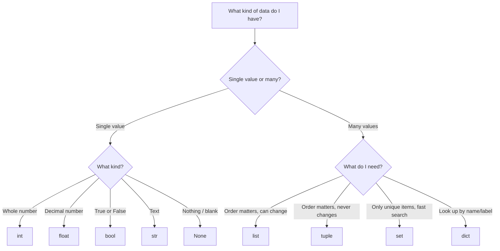

# 📦 Chapter 03: Data Types

> *"Before you can write programs, you need to understand what kind of information you're working with. Every piece of data in Python has a type — and that type determines everything about how you can use it."*

---

## 🌍 Why Do Data Types Exist?

Think about your phone's contact app. It stores:

- A person's **name** → that's text
- Their **age** → that's a whole number
- Their **balance** → that might need a decimal point
- Whether notifications are **on or off** → that's just yes or no
- A list of their **phone numbers** → multiple values together
- Their **social links** → labeled pairs like `"instagram" → "@alice"`

Now imagine Python has to store all of this. It can't treat all of them the same way. You can do math on a number, but math on someone's name makes no sense. You can search through a list, but a single number has nothing to search.

**Data types tell Python: "what is this, and what can you do with it?"**

---

## 📌 Learning Priority

**Must Learn** — Core concept, daily use, interview essential:
`list` · `dict` · `str` · `int` / `float` / `bool` · Comprehensions · `collections.defaultdict` · `collections.Counter` · `collections.deque`

**Should Learn** — Important for real projects, comes up regularly:
`tuple` · `set` · `bytes` / `bytearray` · `frozenset` · String methods (`.split`, `.join`, `.strip`, `.format`)

**Good to Know** — Useful in specific situations:
`collections.OrderedDict` · `str.encode()` / `bytes.decode()` · `slice()` objects · String validation methods (`.isdigit()`, `.isalpha()`)

**Reference** — Know it exists, look up when needed:
`complex` type · `memoryview` · Old `%` string formatting

---

## 🗺️ The Big Picture — All Data Types at a Glance

```
PYTHON DATA TYPES
│
├── NUMBERS ──────── int        → 25, -7, 1000
│                    float      → 3.14, -0.5
│                    complex    → 3+4j
│                    bool       → True, False
│
├── TEXT ─────────── str        → "hello", 'world'
│
├── COLLECTIONS ──── list       → [1, 2, 3]        ordered, changeable
│                    tuple      → (1, 2, 3)        ordered, fixed
│                    set        → {1, 2, 3}        unordered, unique only
│                    dict       → {"name": "Ali"}  key → value pairs
│
└── NOTHING ──────── None       → None             absence of value
```

```
┌───────────────────────────────────────────────────────────────────┐
│  TYPE       EXAMPLE           CHANGEABLE?   KEEPS ORDER?  UNIQUE? │
├───────────────────────────────────────────────────────────────────┤
│  int        42                ✗             –             –       │
│  float      3.14              ✗             –             –       │
│  bool       True              ✗             –             –       │
│  str        "hello"           ✗             ✓             ✗       │
│  list       [1, 2, 3]         ✓             ✓             ✗       │
│  tuple      (1, 2, 3)         ✗             ✓             ✗       │
│  set        {1, 2, 3}         ✓             ✗             ✓       │
│  dict       {"a": 1}          ✓             ✓ (Py 3.7+)   keys ✓  │
│  None       None              ✗             –             –       │
└───────────────────────────────────────────────────────────────────┘
```

**How to check the type of anything:**
```python
print(type(42))         # <class 'int'>
print(type(3.14))       # <class 'float'>
print(type("hello"))    # <class 'str'>
print(type(True))       # <class 'bool'>
print(type([1,2,3]))    # <class 'list'>
print(type(None))       # <class 'NoneType'>
```

---

## 🔢 Part 1: `int` — Whole Numbers

### What is it?

`int` stands for **integer** — a whole number with no decimal point. It can be positive, negative, or zero.

```python
age       = 25
floors    = -3        # basement floors
score     = 0
students  = 1000
big_num   = 9_999_999 # you can use underscores to make big numbers readable
                      # Python ignores them — they're just for your eyes!
```

### What Makes Python's int Special?

In most languages (like C or Java), an integer has a size limit — usually about 2 billion. Go over that, and the program crashes or wraps around to a wrong number.

**Python integers have no limit.** They can be as big as your RAM allows.

```python
# This works perfectly in Python:
really_big = 999_999_999_999_999_999_999_999_999_999
print(really_big + 1)
# 1000000000000000000000000000000  ← no crash, no wrong answer!
```

### int in Different Number Systems

Humans count in base 10 (decimal). But computers use base 2 (binary). Python lets you write numbers in different bases:

```python
decimal = 255           # base 10  — normal numbers
binary  = 0b11111111   # base 2   — starts with 0b
octal   = 0o377        # base 8   — starts with 0o
hexa    = 0xFF         # base 16  — starts with 0x

# All four of these are the same number — 255!
print(decimal == binary == octal == hexa)   # True

# Convert TO different bases:
print(bin(255))    # '0b11111111'   → binary string
print(oct(255))    # '0o377'        → octal string
print(hex(255))    # '0xff'         → hex string
```

### int Arithmetic

```python
a = 17
b = 5

print(a + b)    # 22   → addition
print(a - b)    # 12   → subtraction
print(a * b)    # 85   → multiplication
print(a ** b)   # 1419857 → power (17 to the power of 5)

# Division is where it gets interesting:
print(a / b)    # 3.4  → TRUE division → always gives a float!
print(a // b)   # 3    → FLOOR division → whole number only (cuts decimal off)
print(a % b)    # 2    → MODULO → the remainder after dividing
```

**Understanding floor division and modulo — a real example:**

```
You have 17 apples. You want to pack them into boxes of 5.

17 // 5 = 3   → you can fill 3 complete boxes
17 %  5 = 2   → you'll have 2 apples left over (the remainder)

Check: 3 boxes × 5 apples = 15 apples used + 2 leftover = 17 ✓
```

**Modulo is incredibly useful:**
```python
# Is a number even or odd?
print(10 % 2)   # 0  → 10 is EVEN (no remainder when divided by 2)
print(11 % 2)   # 1  → 11 is ODD  (1 remainder)

# Does a number divide evenly?
# If n % x == 0, then n is divisible by x
print(100 % 4)  # 0  → 100 is divisible by 4

# What's the last digit of a number?
print(12345 % 10)  # 5  → last digit is always: number % 10
```

### Useful int Operations

```python
print(abs(-42))        # 42        → absolute value (makes negative positive)
print(pow(2, 10))      # 1024      → same as 2**10
print(divmod(17, 5))   # (3, 2)    → gives BOTH floor division AND remainder at once!
```

> 📝 **Practice:** [Q1 — Leap Year Check](./practice.md#q1--int--leap-year-check) · [Q2 — Even or Odd](./practice.md#q2--int--even-or-odd) · [Q3 — Floor Division](./practice.md#q3--int--floor-division-and-remainder) · [Q4 — Power & abs()](./practice.md#q4--int--power-and-absolute-value)

---

## 🌊 Part 2: `float` — Decimal Numbers

### What is it?

`float` is for numbers that have a decimal point — measurements, prices, percentages, coordinates, anything that isn't a whole number.

```python
pi          = 3.14159265358979
temperature = 36.6
price       = 999.99
percentage  = 0.18          # 18%
tiny        = 0.000001
big         = 1.5e10        # scientific notation: 1.5 × 10¹⁰ = 15,000,000,000
very_small  = 2.5e-4        # 2.5 × 10⁻⁴ = 0.00025
```

### The Float Precision Problem — The Most Important Warning in Python

This is one of the first things that shocks every Python beginner. Try this:

```python
print(0.1 + 0.2)
```

You'd expect `0.3`. But Python prints: `0.30000000000000004`

**Why does this happen?**

Your computer stores numbers in binary (base 2 — only 0s and 1s). The number `0.1` looks simple in decimal, but in binary it's an infinite repeating pattern:

```
0.1 in binary = 0.00011001100110011001100110011...  (goes on forever!)
```

The computer can only store a limited number of digits, so it stores an approximation. When you do math on approximations, tiny errors appear.

It's the same as `1/3` in decimal — you can't write it exactly, so you write `0.3333...` and there's always a tiny inaccuracy.

**How to handle it:**

```python
# ❌ Never compare floats directly with ==
print(0.1 + 0.2 == 0.3)    # False  ← wrong!

# ✅ Use round() when displaying
print(round(0.1 + 0.2, 2))  # 0.3   ← correct display

# ✅ Use round() for comparisons
print(round(0.1 + 0.2, 10) == 0.3)   # True

# ✅ For financial calculations — use the decimal module (later chapters)
```

### Important float Facts

```python
# Division always gives a float — even if the result is whole:
print(10 / 2)     # 5.0  ← float, not 5!
print(type(10/2)) # <class 'float'>

# Mixing int and float → result is always float:
print(5 + 2.0)    # 7.0  ← int + float = float

# Check if a float is actually a whole number:
print((7.0).is_integer())   # True   → 7.0 is a whole number
print((7.5).is_integer())   # False  → 7.5 is not

# Float limits:
print(1.8e308)     # inf  → beyond float's maximum → becomes infinity
print(-1.8e308)    # -inf → negative infinity

# Special float values:
positive_infinity = float('inf')
negative_infinity = float('-inf')
not_a_number      = float('nan')   # result of invalid operations like 0/0
```

### Float Rounding

```python
print(round(3.14159, 2))    # 3.14       → round to 2 decimal places
print(round(3.14159, 0))    # 3.0        → round to 0 decimal places (still float)
print(round(2.5))           # 2          → Python uses banker's rounding!
print(round(3.5))           # 4          → rounds to nearest EVEN number

# round() for negative decimal places:
print(round(1234, -2))      # 1200       → round to nearest hundred
print(round(1678, -2))      # 1700
```

> 📝 **Practice:** [Q5 — Restaurant Bill](./practice.md#q5--float--restaurant-bill) · [Q6 — BMI Calculator](./practice.md#q6--float--bmi-calculator) · [Q7 — Precision Trap](./practice.md#q7--float--precision-trap) · [Q8 — Temperature](./practice.md#q8--float--temperature-conversion)

---

## ✅ Part 3: `bool` — True or False

### What is it?

`bool` (short for Boolean) has exactly two values: `True` or `False`. It's used for yes/no decisions — is the user logged in? Is the password correct? Is the list empty?

```python
is_logged_in    = True
is_admin        = False
has_permission  = True
is_raining      = False
```

### The Surprising Truth: bool is an Integer!

This is a fascinating Python fact. `bool` is actually a **subtype of `int`**. Under the hood:

```python
True  == 1    # True
False == 0    # True

print(True + True)      # 2   ← yes, you can add booleans!
print(True + False)     # 1
print(True * 10)        # 10
print(False * 10)       # 0

# This is actually USEFUL:
exam_results = [True, False, True, True, False, True]
passed = sum(exam_results)   # counts True as 1, False as 0
print(passed)                # 4  ← 4 students passed!
```

### Truthiness — What "Acts Like" True or False

Python doesn't just use the words `True` and `False`. Many values can act as truthy or falsy in a condition.

```
┌───────────────────────────────────────────────────────────┐
│  FALSY — these all behave like False in conditions        │
│                                                           │
│   0        the number zero (int)                         │
│   0.0      the number zero (float)                       │
│   ""       an empty string                               │
│   []       an empty list                                 │
│   {}       an empty dict                                 │
│   ()       an empty tuple                               │
│   set()    an empty set                                 │
│   None     the absence of value                         │
│   False    False itself                                 │
│                                                           │
│  TRUTHY — everything else, including:                     │
│   1  -1  42   any non-zero number                        │
│   "a"  " "    any non-empty string (even just a space!)  │
│   [0]         a list with items (even if items are falsy)│
│   {"a":1}     a non-empty dict                          │
└───────────────────────────────────────────────────────────┘
```

```python
# In an 'if' condition, Python checks truthiness:
username = ""
if username:
    print("Hello,", username)
else:
    print("Please enter a username")   # ← this runs, because "" is falsy

items = [1, 2, 3]
if items:
    print("Cart has items")    # ← this runs, because non-empty list is truthy

# Explicitly convert anything to bool:
print(bool(0))       # False
print(bool(42))      # True
print(bool(""))      # False
print(bool("hi"))    # True
print(bool([]))      # False
print(bool([0]))     # True  ← list has one item, even if that item is 0!
```

> 📝 **Practice:** [Q9 — Truthiness](./practice.md#q9--bool--truthiness) · [Q10 — Bool Arithmetic](./practice.md#q10--bool--bool-arithmetic) · [Q11 — and/or Shortcuts](./practice.md#q11--bool--and--or-shortcuts)

---

# 🔤 Part 4: `str` — Text
> Full deep-dive: [01_str/theory.md](./01_str/theory.md)

Strings are immutable sequences of characters. Key operations: indexing · slicing · f-strings · `.strip()` `.split()` `.join()` `.replace()` `.lower()` `.upper()`

| Order | Subfolder | Deep-dive |
|---|---|---|
| 1st — learn first | `01_str/` | [theory](./01_str/theory.md) · [practice](./01_str/practice.md) |

> 📝 **Practice:** [str/practice.md](./01_str/practice.md) · [Q12–Q18 in master practice](./practice.md#q12--str--string-methods)

---

# 📋 Part 5: `list` — Ordered Collection
> Full deep-dive: [02_list/theory.md](./02_list/theory.md)

Lists are ordered, mutable sequences. Key operations: indexing · slicing · `.append()` `.remove()` `.sort()` · list comprehensions · copy trap.

| Order | Subfolder | Deep-dive |
|---|---|---|
| 2nd — learn after str | `02_list/` | [theory](./02_list/theory.md) · [practice](./02_list/practice.md) |

> 📝 **Practice:** [list/practice.md](./02_list/practice.md) · [Q19–Q25 in master practice](./practice.md#q19--list--crud-operations)

---

# 📦 Part 6: `tuple` — The Sealed List
> Full deep-dive: [03_tuple/theory.md](./03_tuple/theory.md)

Tuples are ordered, immutable sequences. Use when data should never change: coordinates, RGB values, DB rows. Supports unpacking, can be used as dict keys and set members.

| Order | Subfolder | Deep-dive |
|---|---|---|
| 3rd — learn after list | `03_tuple/` | [theory](./03_tuple/theory.md) · [practice](./03_tuple/practice.md) |

> 📝 **Practice:** [tuple/practice.md](./03_tuple/practice.md) · [Q26–Q30 in master practice](./practice.md#q26--tuple--immutability)

---

# 🎯 Part 7: `set` — Only Unique Items
> Full deep-dive: [04_set/theory.md](./04_set/theory.md)

Sets are unordered collections of unique, hashable items. Use for: deduplication, fast membership checks (O(1)), set math (intersection, union, difference).

| Order | Subfolder | Deep-dive |
|---|---|---|
| 4th — learn after tuple | `04_set/` | [theory](./04_set/theory.md) · [practice](./04_set/practice.md) |

> 📝 **Practice:** [set/practice.md](./04_set/practice.md) · [Q31–Q35 in master practice](./practice.md#q31--set--remove-duplicates)

---

# 🗂️ Part 8: `dict` — Key-Value Pairs
> Full deep-dive: [05_dict/theory.md](./05_dict/theory.md)

Dicts are ordered (Python 3.7+) key-value stores. The most-used complex type in Python. Key operations: `.get()` · `.items()` · `.update()` · dict comprehensions · `collections.defaultdict`.

| Order | Subfolder | Deep-dive |
|---|---|---|
| 5th — learn last | `05_dict/` | [theory](./05_dict/theory.md) · [practice](./05_dict/practice.md) |

> 📝 **Practice:** [dict/practice.md](./05_dict/practice.md) · [Q36–Q42 in master practice](./practice.md#q36--dict--create-and-access)

---

## ❓ Part 9: `None` — The Intentional Blank

### What is it?

`None` represents **the absence of a value** — not zero, not an empty string, not False. It's Python's way of saying "nothing here, intentionally."

```python
result = None          # no result yet
phone  = None          # person has no phone number on file

# Checking for None — always use 'is', not '==':
if result is None:
    print("No result available")

if phone is not None:
    print("Phone:", phone)
else:
    print("Phone not provided")
```

**Why `is` instead of `==`?**

`None` is a special singleton — there's only ONE `None` object in all of Python. `is` checks if it's that exact object. It's more precise and is the Pythonic way.

```python
# When does a variable become None?
# 1. You set it explicitly:
x = None

# 2. A function that has no return statement returns None:
result = print("hello")   # print() doesn't return anything
print(result)              # None  ← because print() has no return value

# 3. .get() on a missing dict key:
d = {"a": 1}
print(d.get("b"))   # None
```

> 📝 **Practice:** [Q43 — Identity Check](./practice.md#q43--none--identity-check) · [Q44 — Optional Value](./practice.md#q44--none--optional-value)

---

## 🔄 Part 10: Type Conversion

### Why Convert Types?

Sometimes data comes in one form and you need it in another:
- User types a number with `input()` → it comes as a string, you need an int
- You want to display a number inside a sentence → number to string
- A list has duplicates and you want them removed → list to set

### Common Conversions

```python
# → int
int("42")        # 42         string to int
int(3.9)         # 3          float to int (TRUNCATES — cuts off decimal, doesn't round!)
int(True)        # 1          bool to int
int(False)       # 0

# ⚠️ These will CRASH:
# int("hello")   → ValueError: invalid literal
# int("3.14")    → ValueError: use float("3.14") first!

# → float
float("3.14")    # 3.14       string to float
float(42)        # 42.0       int to float
float(True)      # 1.0

# → str
str(42)          # "42"       int to string
str(3.14)        # "3.14"     float to string
str(True)        # "True"     bool to string
str([1,2,3])     # "[1, 2, 3]" list to string representation

# → bool
bool(0)          # False
bool(1)          # True
bool("")         # False
bool("hello")    # True
bool([])         # False
bool([1,2])      # True

# → list
list("Python")   # ['P','y','t','h','o','n']   string → list of chars
list((1,2,3))    # [1, 2, 3]                   tuple → list
list({1,2,3})    # [1, 2, 3]  (order may vary) set → list

# → tuple
tuple([1,2,3])   # (1, 2, 3)   list → tuple
tuple("abc")     # ('a','b','c')

# → set (removes duplicates)
set([1,2,2,3])   # {1, 2, 3}
set("hello")     # {'h','e','l','o'}
```

### The Most Common Conversion — Input from User

```python
# input() ALWAYS returns a string — no matter what the user types!
name = input("Enter your name: ")   # string — correct, names are text
age  = input("Enter your age: ")    # ← this is a string "25", not the number 25!

# This will CRASH:
next_year = age + 1   # ❌ TypeError: can't add str and int

# FIX — convert immediately:
age = int(input("Enter your age: "))   # ✅ now it's an integer
next_year = age + 1   # ✅ works!
```

> 📝 **Practice:** [Q45 — int and float](./practice.md#q45--type-conversion--int-and-float) · [Q46 — input() Trap](./practice.md#q46--type-conversion--the-input-trap) · [Q47 — bool conversion](./practice.md#q47--type-conversion--bool-conversion)

---

## 🔄 How to Choose the Right Type



---

## ⚠️ The Most Important Gotchas

```python
# 1. {} is an empty DICT, not empty set
empty_dict = {}       # dict!
empty_set  = set()    # correct way for empty set

# 2. Single-item tuple NEEDS a trailing comma
just_42    = (42)     # this is the int 42, NOT a tuple
real_tuple = (42,)    # this IS a tuple

# 3. Copying a list
b = a        # NOT a copy — both point to same list!
b = a.copy() # actual copy

# 4. int() truncates, doesn't round
int(3.9)     # 3, not 4!
int(3.1)     # 3
round(3.9)   # 4  ← use round() when you want rounding

# 5. input() always returns a string
age = input("Age: ")    # "25"  → string!
age = int(input("Age: ")) # 25 → int ✅

# 6. Float comparison trap
0.1 + 0.2 == 0.3   # False! Use round() or just avoid == with floats

# 7. list.sort() vs sorted()
lst.sort()       # changes the list, returns None
sorted(lst)      # returns a new list, original untouched
```

---

## 🎬 Chapter Summary

```
You now know all of Python's core data types:
━━━━━━━━━━━━━━━━━━━━━━━━━━━━━━━━━━━━━━━━━━━━━━━━━━━━━━━━━━━━━
  int     Whole numbers, any size, floor div //, modulo %
  float   Decimals, precision trap, use round() wisely
  bool    True/False, subtype of int, truthiness concept
  str     Text, immutable, indexing/slicing, 20+ methods
  list    Ordered, mutable, any types, append/pop/sort
  tuple   Ordered, immutable, unpacking, use as dict key
  set     Unique items, fast O(1) search, set math
  dict    Key-value pairs, .get() is your friend, nested dicts
  None    Intentional emptiness, use 'is' to check
━━━━━━━━━━━━━━━━━━━━━━━━━━━━━━━━━━━━━━━━━━━━━━━━━━━━━━━━━━━━━
```

---

## 🔢 `bytes` and `bytearray` — Binary Data

When you work with files, network sockets, or encoding text, you deal with **raw binary data** — not strings.

**`bytes`** — immutable sequence of integers (0–255)
**`bytearray`** — mutable version of bytes

```python
# Creating bytes:
b1 = b"hello"               # literal
b2 = bytes([72, 101, 108])  # from list of ints
b3 = "hello".encode("utf-8")  # from string

# Creating bytearray (mutable):
ba = bytearray(b"hello")
ba[0] = 72                  # can modify
ba.append(33)               # can append

# Key operations:
b = b"hello world"
b[0]          # 104  (int, not char)
b[0:5]        # b'hello'
len(b)        # 11
b.decode("utf-8")   # "hello world"  ← back to string

# String ↔ bytes conversion (always specify encoding):
text = "café"
encoded = text.encode("utf-8")    # b'caf\xc3\xa9'
decoded = encoded.decode("utf-8") # "café"
```

**When you need this:**

```python
# Reading binary files:
with open("image.png", "rb") as f:   # "rb" = read binary
    data = f.read()                   # bytes object

# Network sockets:
sock.send(b"GET / HTTP/1.1\r\n")     # must be bytes, not str

# Checking file headers (magic bytes):
with open("file", "rb") as f:
    header = f.read(4)
    if header == b"\x89PNG":
        print("This is a PNG file")
```

**`bytes` vs `str` — the key difference:**

```python
type(b"hello")   # <class 'bytes'>
type("hello")    # <class 'str'>

# You cannot mix them:
b"hello" + " world"    # TypeError — must use bytes + bytes
b"hello" + b" world"   # b'hello world' ✓
```

---

## 🗂️ `collections` Module — Smarter Data Structures

Python's `collections` module gives you specialized containers that solve common problems better than plain dicts and lists.

### `defaultdict` — Dictionary That Never Raises KeyError

```python
from collections import defaultdict


# Regular dict — KeyError if key missing:
counts = {}
counts["apple"] += 1    # KeyError: 'apple'

# defaultdict — creates default value automatically:
counts = defaultdict(int)   # default value: 0
counts["apple"] += 1        # works — starts at 0
counts["apple"] += 1
print(counts["apple"])      # 2
print(counts["banana"])     # 0 — created automatically

# Group items by key:
from collections import defaultdict
groups = defaultdict(list)
for item in ["a", "b", "a", "c", "b", "a"]:
    groups[item].append(item)
# defaultdict(<class 'list'>, {'a': ['a', 'a', 'a'], 'b': ['b', 'b'], 'c': ['c']})
```

> 📝 **Practice:** [Q82 · compare-dict-defaultdict](../python_practice_questions_100.md#q82--interview--compare-dict-defaultdict)


### `Counter` — Frequency Counting

```python
from collections import Counter

# Count occurrences in one line:
words = ["apple", "banana", "apple", "cherry", "banana", "apple"]
count = Counter(words)
# Counter({'apple': 3, 'banana': 2, 'cherry': 1})

count["apple"]      # 3
count["missing"]    # 0  ← no KeyError (like defaultdict)
count.most_common(2)  # [('apple', 3), ('banana', 2)]

# Counter arithmetic:
c1 = Counter(a=3, b=2)
c2 = Counter(a=1, b=4)
c1 + c2   # Counter({'b': 6, 'a': 4})
c1 - c2   # Counter({'a': 2})  ← only positive counts kept

# Count characters in a string:
Counter("mississippi")
# Counter({'s': 4, 'i': 4, 'p': 2, 'm': 1})
```

### `deque` — Double-Ended Queue

A regular list is slow (`O(n)`) when inserting/removing at the front.
`deque` is `O(1)` at BOTH ends.

```python
from collections import deque

d = deque([1, 2, 3])
d.append(4)        # add to right:  [1, 2, 3, 4]
d.appendleft(0)    # add to left:   [0, 1, 2, 3, 4]
d.pop()            # remove right:  returns 4
d.popleft()        # remove left:   returns 0

# Fixed-size sliding window (maxlen):
recent = deque(maxlen=3)
for x in range(6):
    recent.append(x)
    print(list(recent))
# [0]
# [0, 1]
# [0, 1, 2]
# [1, 2, 3]  ← oldest dropped automatically
# [2, 3, 4]
# [3, 4, 5]
```

**Use `deque` when:** implementing queues, BFS algorithms, sliding windows, or any pattern needing fast front-insertion.

### `frozenset` — Immutable Set

```python
# frozenset is hashable — can be used as dict key or in another set:
fs = frozenset([1, 2, 3])
fs.add(4)   # AttributeError — immutable

# Use as dict key (regular set can't do this):
cache = {}
cache[frozenset([1, 2, 3])] = "result"

# Use as set of sets:
seen = set()
seen.add(frozenset([1, 2]))   # frozenset is hashable, set is not
```

**Quick reference — when to use each:**

```
defaultdict  → grouping, counting, graph adjacency lists
Counter      → frequency analysis, most common items, bag operations
deque        → queues, BFS/DFS, sliding windows, recent-N items
frozenset    → set as dict key, immutable set membership
```

---

## 🧭 Navigation

| | |
|---|---|
| ⬅️ Previous | [02 — Control Flow](../02_control_flow/README.md) |
| 💻 Practice | [practice.md](./practice.md) |
| 🎤 Interview | [interview.md](./interview.md) |
| ⚡ Cheatsheet | [cheetsheet.md](./cheetsheet.md) |
| ➡️ Next | [04 — Functions](../04_functions/README.md) |
| 🏠 Home | [01_Python_Mastery](../README.md) |

---

**[🏠 Back to README](../README.md)**

**Prev:** [← Control Flow — Interview Q&A](../02_control_flow/interview.md) &nbsp;|&nbsp; **Next:** [Complexity Analysis →](./06_complexity/theory.md)

**Related Topics:** [Complexity Analysis](./06_complexity/theory.md) · [Cheat Sheet](./cheetsheet.md) · [Complexity Analysis Interview](./06_complexity/interview.md) · [Interview Q&A](./interview.md) · [Collections Module](./07_collections/theory.md)
