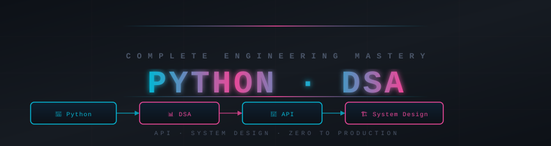

<div align="center">



</div>

<div align="center">

[](https://python.org)
[](#02_DSA_Mastery)
[](./03_API_Mastery/)
[](#04_System_Design_Mastery)
[](#full-curriculum)
[](LICENSE)

**Zero to Production · Python · DSA · API · System Design · Interview Ready**

</div>


## 🔥 What Is This Repo?

A complete, structured engineering mastery system — built to take you from absolute beginner all the way to production-ready professional and FAANG-level interview candidate.

Every topic follows a structured format:

- 📖 **Theory** — Deep explanations with real-world analogies and internals
- 💻 **Practice** — Runnable code with heavy inline comments explaining *why*
- 🎯 **Interview** — Q&A from junior to senior/FAANG level
- 📊 **Cheatsheets** — Quick-reference cards you'll bookmark forever

> This is not just notes. This is a complete mastery system built for engineers who want to think at a professional level.


<div align="center">

## 🗺️ Part of the Learning Stack

This repo is one track in a complete AI/ML/DevOps engineering curriculum.

[](./MASTER_LEARNING_PATH.md)

</div>

---

<div align="center">

## 🗺️ The Four Masteries

</div>

<div align="center">

| # | Mastery | What You Master | Folder | Level |
|---|---------|-----------------|--------|-------|
| 🐍 **01** | [Python Complete Mastery](./01_Python_Mastery/README.md) | Language internals, advanced patterns, concurrency, testing, production engineering | `01_Python_Mastery/` | Core → Expert |
| 📊 **02** | [DSA Complete Mastery](./02_DSA_Mastery/README.md) | Every data structure and algorithm, patterns, FAANG-level problem solving | `02_DSA_Mastery/` | Beginner → FAANG |
| 🔌 **03** | [API Mastery](./03_API_Mastery/README.md) | REST, FastAPI, GraphQL, gRPC, auth, security, deployment | `03_API_Mastery/` | Beginner → Production |
| 🏗️ **04** | [System Design Mastery](./04_System_Design_Mastery/README.md) | HLD, LLD, distributed systems, cloud, real-world case studies | `04_System_Design_Mastery/` | Junior → Staff |

**Total: 548+ topics · 300+ hours of structured learning**

</div>


<div align="center">

## 🛤️ Choose Your Path

</div>

<details>
<summary><strong>🟢 Beginner Path — I'm new to Python / engineering (Start here!)</strong></summary>

> Goal: Build strong Python fundamentals, understand core data structures, make your first API.

| Step | Module | What You'll Learn |
|------|--------|-------------------|
| 1 | [Python Fundamentals](./01_Python_Mastery/01_python_fundamentals/theory.md) | Variables, types, references, mutability, memory model |
| 2 | [Control Flow](./01_Python_Mastery/02_control_flow/theory.md) | Loops, conditionals, break/continue, loop-else, comprehensions |
| 3 | [Data Types](./01_Python_Mastery/03_data_types/theory.md) | Lists, dicts, sets, tuples — when to use each |
| 4 | [Functions](./01_Python_Mastery/04_functions/theory.md) | def, args, kwargs, closures, decorators basics |
| 5 | [OOP](./01_Python_Mastery/05_oops/theory_part1.md) | Classes, inheritance, dunder methods, ABC |
| 6 | [Complexity Analysis](./02_DSA_Mastery/01_complexity_analysis/theory.md) | Big O — how to reason about speed and memory |
| 7 | [Arrays & Strings](./02_DSA_Mastery/02_arrays/theory.md) | Core operations, two-pointer, sliding window |
| 8 | [What is an API?](./03_API_Mastery/01_what_is_an_api/story.md) | HTTP, request-response, status codes, your first API call |

**Prerequisite:** Basic command line and one programming language.

</details>

<details>
<summary><strong>🟡 Intermediate Path — I know Python basics, want to build production systems</strong></summary>

> Goal: Write production-grade Python, design APIs, solve medium DSA problems confidently.

| Step | Module | What You'll Learn |
|------|--------|-------------------|
| 1 | [Decorators](./01_Python_Mastery/10_decorators/theory.md) | Function decorators, class decorators, functools.wraps |
| 2 | [Generators & Iterators](./01_Python_Mastery/11_generators_iterators/theory.md) | yield, generator pipelines, memory-efficient processing |
| 3 | [Context Managers](./01_Python_Mastery/12_context_managers/theory.md) | with, __enter__/__exit__, contextlib |
| 4 | [FastAPI Mastery](./03_API_Mastery/07_fastapi/core_guide.md) | Pydantic, dependency injection, routers, database integration |
| 5 | [Authentication](./03_API_Mastery/05_authentication/securing_apis.md) | OAuth2, JWT, API keys, rate limiting |
| 6 | [Trees & Graphs](./02_DSA_Mastery/14_trees/theory.md) | BFS, DFS, tree traversals, graph algorithms |
| 7 | [Databases](./04_System_Design_Mastery/05_databases/theory.md) | SQL vs NoSQL, indexing, transactions, replication |
| 8 | [Caching](./04_System_Design_Mastery/06_caching/theory.md) | Redis, cache patterns, TTL, eviction strategies |

**Prerequisite:** Beginner path complete.

</details>

<details>
<summary><strong>🔴 Advanced Path — I want concurrency, design patterns, and scalable systems</strong></summary>

> Goal: Write concurrent Python, apply design patterns, design systems that scale.

| Step | Module | What You'll Learn |
|------|--------|-------------------|
| 1 | [Concurrency](./01_Python_Mastery/13_concurrency/theory.md) | Threading, multiprocessing, asyncio, GIL |
| 2 | [Design Patterns](./01_Python_Mastery/16_design_patterns/theory.md) | Singleton, Factory, Observer, Strategy, Command |
| 3 | [Performance Optimization](./01_Python_Mastery/18_performance_optimization/profiling.md) | cProfile, timeit, __slots__, algorithm optimization |
| 4 | [Testing](./01_Python_Mastery/17_testing/theory.md) | pytest, mocking, fixtures, TDD, integration testing |
| 5 | [Dynamic Programming](./02_DSA_Mastery/21_dynamic_programming/theory.md) | Memoization, tabulation, classic DP patterns |
| 6 | [Distributed Systems](./04_System_Design_Mastery/10_distributed_systems/theory.md) | Raft, consensus, partitioning, quorum, split-brain |
| 7 | [API Performance](./03_API_Mastery/09_api_performance_scaling/performance_guide.md) | N+1, connection pools, horizontal scaling, metrics |
| 8 | [Microservices](./04_System_Design_Mastery/12_microservices/theory.md) | Service decomposition, service mesh, communication patterns |

**Prerequisite:** Intermediate path complete.

</details>

<details>
<summary><strong>🟣 FAANG Path — I'm targeting senior/staff level interviews</strong></summary>

> Goal: Solve hard DSA problems, design any system end-to-end, answer senior-level questions.

| Step | Module | What You'll Learn |
|------|--------|-------------------|
| 1 | [Advanced Graphs](./02_DSA_Mastery/25_advanced_graphs/theory.md) | Bellman-Ford, Floyd-Warshall, Tarjan, Kruskal |
| 2 | [Advanced Python](./01_Python_Mastery/15_advanced_python/theory.md) | Metaclasses, descriptors, __slots__, memory internals |
| 3 | [System Design HLD](./04_System_Design_Mastery/16_high_level_design/theory.md) | Capacity estimation, trade-off analysis, architecture decisions |
| 4 | [LLD & Clean Architecture](./04_System_Design_Mastery/17_low_level_design/theory.md) | SOLID, OOP modeling, state machines, class design |
| 5 | [Data Engineering](./01_Python_Mastery/21_data_engineering_applications/theory.md) | Pipelines, streaming, ETL, memory-efficient processing |
| 6 | [Case Studies](./04_System_Design_Mastery/22_case_studies/theory.md) | Twitter, Netflix, Uber, WhatsApp, URL Shortener |
| 7 | [Python Interview Master](./01_Python_Mastery/99_interview_master/python_3_5_years.md) | Scenario-based Q&A, edge cases, concurrency problems |
| 8 | [DSA FAANG Questions](./02_DSA_Mastery/99_interview_master/faang_level_questions.md) | Hard problems with pattern analysis and optimal solutions |

**Prerequisite:** Advanced path complete.

</details>


<div align="center">

## 📚 Full Curriculum

</div>

<details>
<summary><strong>🐍 Python Complete Mastery — 21 modules</strong></summary>

**Section 1: Core Python**

| Module | Topic | Files |
|--------|-------|-------|
| 01 | [Python Fundamentals](./01_Python_Mastery/01_python_fundamentals/theory.md) | theory · practice · edge_cases |
| 02 | [Control Flow](./01_Python_Mastery/02_control_flow/theory.md) | theory · practice · pattern_programs |
| 03 | [Data Types](./01_Python_Mastery/03_data_types/theory.md) | theory · list/dict/set/tuple practice |
| 04 | [Functions](./01_Python_Mastery/04_functions/theory.md) | theory · practice |
| 05 | [OOP](./01_Python_Mastery/05_oops/theory_part1.md) | theory · practice |
| 06 | [Exceptions & Error Handling](./01_Python_Mastery/06_exceptions_error_handling/theory.md) | theory |

**Section 2: Advanced Python**

| Module | Topic | Files |
|--------|-------|-------|
| 07 | [Modules & Packages](./01_Python_Mastery/07_modules_packages/theory.md) | theory |
| 08 | [File Handling](./01_Python_Mastery/08_file_handling/theory.md) | theory |
| 09 | [Logging & Debugging](./01_Python_Mastery/09_logging_debugging/theory.md) | theory |
| 10 | [Decorators](./01_Python_Mastery/10_decorators/theory.md) | theory |
| 11 | [Generators & Iterators](./01_Python_Mastery/11_generators_iterators/theory.md) | theory |
| 12 | [Context Managers](./01_Python_Mastery/12_context_managers/theory.md) | theory |
| 13 | [Concurrency](./01_Python_Mastery/13_concurrency/theory.md) | theory · multithreading · multiprocessing · asyncio |
| 14 | [Memory Management](./01_Python_Mastery/01.1_memory_management/theory.md) | theory |
| 15 | [Advanced Python](./01_Python_Mastery/15_advanced_python/theory.md) | theory |

**Section 3: Architecture & Production**

| Module | Topic | Files |
|--------|-------|-------|
| 16 | [Design Patterns](./01_Python_Mastery/16_design_patterns/theory.md) | theory · singleton · factory · observer · strategy |
| 17 | [Testing](./01_Python_Mastery/17_testing/theory.md) | theory |
| 18 | [Performance Optimization](./01_Python_Mastery/18_performance_optimization/profiling.md) | profiling · timeit · cProfile · optimization patterns |
| 19 | [Production Best Practices](./01_Python_Mastery/19_production_best_practices/project_structure.md) | project structure |
| 20 | [System Design with Python](./01_Python_Mastery/20_system_design_with_python/theory.md) | theory · caching · rate limiting |
| 21 | [Data Engineering](./01_Python_Mastery/21_data_engineering_applications/theory.md) | theory · pipelines · ETL · streaming |

**Interview Master**

| File | Level |
|------|-------|
| [python_0_2_years.md](./01_Python_Mastery/99_interview_master/python_0_2_years.md) | Junior |
| [python_3_5_years.md](./01_Python_Mastery/99_interview_master/python_3_5_years.md) | Senior |
| [scenario_based_questions.md](./01_Python_Mastery/99_interview_master/scenario_based_questions.md) | Scenario |
| [tricky_edge_cases.md](./01_Python_Mastery/99_interview_master/tricky_edge_cases.md) | Edge Cases |

</details>

<details>
<summary><strong>📊 DSA Complete Mastery — 26 topics</strong></summary>

**Phase 1: Foundations**

| # | Topic | Files |
|---|-------|-------|
| 01 | [Complexity Analysis](./02_DSA_Mastery/01_complexity_analysis/theory.md) | theory · interview · cheatsheet · visual |
| 02 | [Arrays](./02_DSA_Mastery/02_arrays/theory.md) | theory · interview · cheatsheet · implementation · problems |
| 03 | [Strings](./02_DSA_Mastery/03_strings/theory.md) | theory · interview · cheatsheet · implementation · problems |
| 04 | [Recursion](./02_DSA_Mastery/04_recursion/theory.md) | theory · interview · cheatsheet · implementation |
| 05 | [Sorting](./02_DSA_Mastery/05_sorting/theory.md) | theory · interview · cheatsheet · basic + advanced |
| 06 | [Searching](./02_DSA_Mastery/06_searching/theory.md) | theory · interview · cheatsheet |

**Phase 2: Linear Structures + Patterns**

| # | Topic | Files |
|---|-------|-------|
| 07 | [Linked List](./02_DSA_Mastery/07_linked_list/theory.md) | theory · interview · cheatsheet · implementation |
| 08 | [Stack](./02_DSA_Mastery/08_stack/theory.md) | theory · interview · cheatsheet · implementation |
| 09 | [Queue](./02_DSA_Mastery/09_queue/theory.md) | theory · interview · cheatsheet · implementation |
| 10 | [Hashing](./02_DSA_Mastery/10_hashing/theory.md) | theory · interview · cheatsheet · real world |
| 11 | [Two Pointers](./02_DSA_Mastery/11_two_pointers/theory.md) | theory · patterns · interview |
| 12 | [Sliding Window](./02_DSA_Mastery/12_sliding_window/theory.md) | theory · patterns · interview |
| 13 | [Binary Search](./02_DSA_Mastery/13_binary_search/theory.md) | theory · patterns · interview |

**Phase 3: Trees, Heaps & Graphs**

| # | Topic | Files |
|---|-------|-------|
| 14 | [Trees](./02_DSA_Mastery/14_trees/theory.md) | theory · patterns · interview |
| 15 | [Binary Search Trees](./02_DSA_Mastery/15_binary_search_trees/theory.md) | theory · patterns · interview |
| 16 | [Heaps](./02_DSA_Mastery/16_heaps/theory.md) | theory · patterns · interview |
| 17 | [Trie](./02_DSA_Mastery/17_trie/theory.md) | theory · patterns · interview |
| 18 | [Graphs](./02_DSA_Mastery/18_graphs/theory.md) | theory · patterns · interview |

**Phase 4: Advanced Problem Solving**

| # | Topic | Files |
|---|-------|-------|
| 19 | [Greedy](./02_DSA_Mastery/19_greedy/theory.md) | theory · patterns · interview |
| 20 | [Backtracking](./02_DSA_Mastery/20_backtracking/theory.md) | theory · patterns · interview |
| 21 | [Dynamic Programming](./02_DSA_Mastery/21_dynamic_programming/theory.md) | theory · patterns · interview |
| 22 | [Bit Manipulation](./02_DSA_Mastery/22_bit_manipulation/theory.md) | theory · patterns · interview |
| 23 | [Segment Tree](./02_DSA_Mastery/23_segment_tree/theory.md) | theory · interview |
| 24 | [Disjoint Set Union](./02_DSA_Mastery/24_disjoint_set_union/theory.md) | theory · patterns · interview |
| 25 | [Advanced Graphs](./02_DSA_Mastery/25_advanced_graphs/theory.md) | theory · patterns · interview |

**Interview Master**

| File | Level |
|------|-------|
| [0_2_years.md](./02_DSA_Mastery/99_interview_master/0_2_years.md) | Junior |
| [3_5_years.md](./02_DSA_Mastery/99_interview_master/3_5_years.md) | Senior |
| [faang_level_questions.md](./02_DSA_Mastery/99_interview_master/faang_level_questions.md) | FAANG |

</details>

<details>
<summary><strong>🔌 API Mastery — 19 topics</strong></summary>

| # | Topic | Core Concept |
|---|-------|-------------|
| 01 | [What is an API?](./03_API_Mastery/01_what_is_an_api/story.md) | HTTP, request-response, status codes, headers |
| 02 | [REST Fundamentals](./03_API_Mastery/02_rest_fundamentals/rest_explained.md) | Resources, HTTP verbs, statelessness, idempotency |
| 03 | [REST Best Practices](./03_API_Mastery/03_rest_best_practices/patterns.md) | URL design, versioning, pagination, error formats |
| 04 | [Data Formats](./03_API_Mastery/04_data_formats/serialization_guide.md) | JSON types, Pydantic validation, XML, binary formats |
| 05 | [Authentication](./03_API_Mastery/05_authentication/securing_apis.md) | OAuth2, JWT, API keys, sessions, rate limiting, CORS |
| 06 | [Error Handling](./03_API_Mastery/06_error_handling_standards/error_guide.md) | Error formats, pagination, filtering, sorting |
| **07** | **[FastAPI Mastery](./03_API_Mastery/07_fastapi/README.md)** | **ASGI, Pydantic, Depends, middleware, routers, databases** |
| 08 | [API Versioning](./03_API_Mastery/08_versioning_standards/versioning_strategy.md) | Breaking vs non-breaking changes, URL vs header versioning |
| 09 | [API Performance](./03_API_Mastery/09_api_performance_scaling/performance_guide.md) | Caching, N+1, connection pools, horizontal scaling |
| 10 | [Testing & Docs](./03_API_Mastery/10_testing_documentation/testing_apis.md) | TestClient, contract testing, OpenAPI docs |
| 11 | [Security in Production](./03_API_Mastery/11_api_security_production/security_hardening.md) | HTTPS, input validation, token security, audit logs |
| 12 | [Production Deployment](./03_API_Mastery/12_production_deployment/deployment_guide.md) | Docker, Gunicorn/Uvicorn, Kubernetes, CI/CD |
| 13 | [GraphQL](./03_API_Mastery/13_graphql/graphql_story.md) | Schema, queries, mutations, subscriptions, N+1, DataLoader |
| 14 | [gRPC](./03_API_Mastery/14_grpc/grpc_guide.md) | Protocol Buffers, 4 streaming modes, Python client/server |
| 15 | [API Gateway](./03_API_Mastery/15_api_gateway/gateway_patterns.md) | Routing, auth offload, rate limiting, BFF pattern |
| 16 | [API Design Patterns](./03_API_Mastery/16_api_design_patterns/design_guide.md) | Idempotency keys, bulk ops, long-running operations |
| 17 | [WebSockets](./03_API_Mastery/17_websockets/realtime_apis.md) | Full-duplex, handshake, use cases, scaling |
| 18 | [Real-World APIs](./03_API_Mastery/18_real_world_apis/architectures.md) | Payment, social media, ride-sharing, SaaS API design |
| 99 | [Interview Master](./03_API_Mastery/99_interview_master/api_questions.md) | Junior → Senior Q&A, API design problems |

</details>

<details>
<summary><strong>🏗️ System Design Mastery — 24 topics</strong></summary>

| Stage | # | Topic | Core Concept |
|-------|---|-------|-------------|
| 🖥️ Foundations | 00 | [Computer Fundamentals](./04_System_Design_Mastery/00_computer_fundamentals/story.md) | CPU, RAM, disk, processes, threads, I/O |
| | 01 | [Networking Basics](./04_System_Design_Mastery/01_networking_basics/theory.md) | TCP/IP, HTTP/1–3, TLS, DNS, WebSockets, gRPC |
| | 02 | [System Fundamentals](./04_System_Design_Mastery/02_system_fundamentals/theory.md) | CAP, latency, throughput, availability, SLOs |
| 🔌 Services | 03 | [API Design](./04_System_Design_Mastery/03_api_design/theory.md) | REST, GraphQL, gRPC, versioning, idempotency |
| | 04 | [Backend Architecture](./04_System_Design_Mastery/04_backend_architecture/intro.md) | Client-server, monolith, stateless services |
| 🗄️ Data | 05 | [Databases](./04_System_Design_Mastery/05_databases/theory.md) | SQL vs NoSQL, ACID, indexing, replication, sharding |
| | 06 | [Caching](./04_System_Design_Mastery/06_caching/theory.md) | Redis, cache patterns, eviction, CDN |
| | 07 | [Storage & CDN](./04_System_Design_Mastery/07_storage_cdn/theory.md) | Object storage, block storage, CDN strategy |
| ⚡ Scale | 08 | [Load Balancing](./04_System_Design_Mastery/08_load_balancing/theory.md) | L4 vs L7, algorithms, health checks, sticky sessions |
| | 09 | [Message Queues](./04_System_Design_Mastery/09_message_queues/theory.md) | Kafka, RabbitMQ, SQS, at-least-once, fan-out |
| | 10 | [Distributed Systems](./04_System_Design_Mastery/10_distributed_systems/theory.md) | Raft, consensus, replication, partitioning, quorum |
| 🏗️ Architecture | 11 | [Scalability Patterns](./04_System_Design_Mastery/11_scalability_patterns/theory.md) | CQRS, event sourcing, saga, write amplification |
| | 12 | [Microservices](./04_System_Design_Mastery/12_microservices/theory.md) | Monolith → microservices, service mesh |
| | 13 | [Security](./04_System_Design_Mastery/13_security/theory.md) | Auth, OAuth2, JWT, rate limiting, DDoS |
| | 14 | [Observability](./04_System_Design_Mastery/14_observability/theory.md) | Metrics, logs, traces, SLOs, alerting |
| | 15 | [Cloud Architecture](./04_System_Design_Mastery/15_cloud_architecture/theory.md) | AWS/GCP/Azure, serverless, containers, K8s |
| 📐 Design | 16 | [High Level Design](./04_System_Design_Mastery/16_high_level_design/theory.md) | System architecture, capacity estimation, trade-offs |
| | 17 | [Low Level Design](./04_System_Design_Mastery/17_low_level_design/theory.md) | SOLID, OOP, design patterns, class modeling |
| | 18 | [Design Patterns](./04_System_Design_Mastery/18_design_patterns/theory.md) | GoF patterns: Factory, Observer, Strategy, Command |
| | 19 | [Clean Architecture](./04_System_Design_Mastery/19_clean_architecture/theory.md) | Hexagonal, DDD, bounded contexts, repositories |
| 📊 Data Scale | 20 | [Data Systems at Scale](./04_System_Design_Mastery/20_data_systems/theory.md) | Data warehouses, lakes, ETL/ELT, Spark, pipelines |
| | 21 | [Real-Time Systems](./04_System_Design_Mastery/21_real_time_systems/theory.md) | Stream processing, event-driven, WebRTC, live systems |
| 🎯 Practice | 22 | [Case Studies](./04_System_Design_Mastery/22_case_studies/theory.md) | URL Shortener, Twitter, Netflix, Uber, WhatsApp |
| | 23 | [Interview Framework](./04_System_Design_Mastery/23_interview_framework/theory.md) | 45-minute structured approach |

</details>


<div align="center">

## 🧠 Master Revision Strategy

</div>

<div align="center">

| Phase | Focus | Duration | Goal |
|-------|-------|----------|------|
| 🟢 **Phase 1** | Python core + OOP + Complexity + Arrays/Strings/Recursion + System fundamentals | 2–3 weeks | Build unshakeable foundation |
| 🟡 **Phase 2** | Two pointers + Sliding window + Binary search + Trees + Heaps + FastAPI + Databases | 2–3 weeks | Pattern recognition, build APIs |
| 🔴 **Phase 3** | Graphs + DP + Python concurrency + Design patterns + Distributed systems + HLD/LLD | 2–3 weeks | Production-ready thinking |
| 🟣 **Phase 4** | Advanced DSA + Scenario Q&A + Mock interviews + Edge cases + Company patterns | 2 weeks | Interview fluency and confidence |

</div>


<div align="center">

## 🚀 Start Here

</div>

**New to Python?** → [Python Fundamentals](./01_Python_Mastery/01_python_fundamentals/theory.md)

**Know Python, starting DSA?** → [Complexity Analysis](./02_DSA_Mastery/01_complexity_analysis/theory.md)

**Want to build APIs?** → [What is an API?](./03_API_Mastery/01_what_is_an_api/story.md) → [FastAPI Mastery](./03_API_Mastery/07_fastapi/README.md)

**Preparing for interviews?** → [Quick Start Guide](./01_QUICK_START.md) → [Learning Path](./02_LEARNING_PATH.md)

**System design interviews?** → [System Fundamentals](./04_System_Design_Mastery/02_system_fundamentals/theory.md) → [HLD](./04_System_Design_Mastery/16_high_level_design/theory.md)

**Daily reference?** → [Daily Job Guide](./04_DAILY_JOB_GUIDE.md)

**Full multi-repo learning path?** → [Master Learning Path](./03_MASTER_02_LEARNING_PATH.md) — 12-phase roadmap across all repos

**AI Engineer career roadmap?** → [AI Engineer Roadmap](./05_AI_ENGINEER_ROADMAP.md) — full path from fundamentals to production

**Want to test yourself?** → [100 Python Questions](./01_Python_Mastery/python_practice_questions_100.md) — basics to critical thinking, answers hidden until you click
**Practice DSA?** → [100 DSA Questions](./02_DSA_Mastery/dsa_practice_questions_100.md) — Big O to system design, trace executions, debug algorithms
**Practice APIs?** → [100 API Questions](./03_API_Mastery/api_practice_questions_100.md) — HTTP basics to production architecture, FastAPI to GraphQL
**Practice System Design?** → [100 System Design Questions](./04_System_Design_Mastery/system_design_practice_questions_100.md) — fundamentals to real-world distributed systems


<div align="center">

## 📅 Daily Study Formula

</div>

<div align="center">

```
1 hour  → DSA problem solving (pattern-based)
1 hour  → Python advanced / System Design theory
30 min  → Interview Q&A revision
30 min  → Build something (API endpoint, algorithm, design problem)
```

**Consistency beats intensity. Depth beats breadth.**

</div>


<div align="center">

*Python · DSA · API · System Design · Zero to Production · Interview Ready*

</div>
