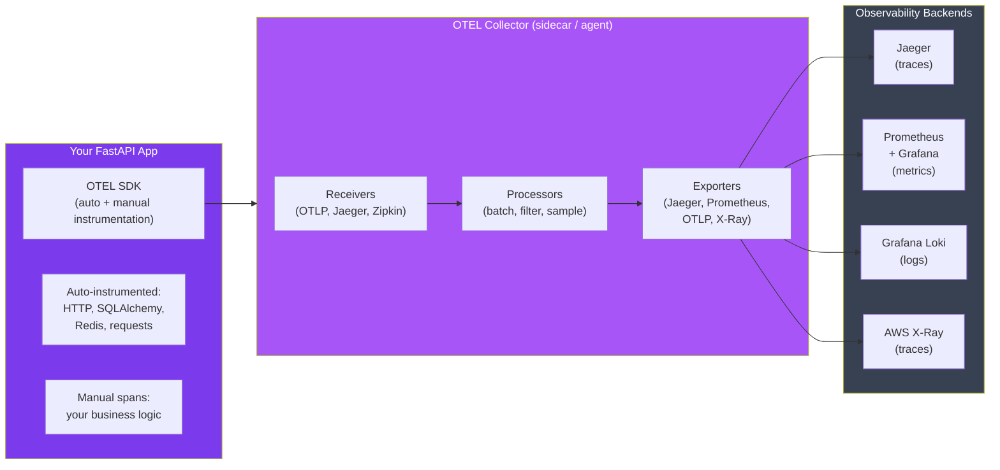

# Stage 19 — OpenTelemetry: Instrument Your Python APIs

> The universal language of observability — one SDK, any backend, zero vendor lock-in.

---

## 1. Core Intuition

Your FastAPI service is getting slow. Users complain. You check logs — nothing obvious. You check CPU — looks fine. You have no idea where the 2 seconds are going.

Now imagine your entire request journey is visible:

```
POST /checkout  total: 1,847ms
├── validate_cart()          12ms
├── check_inventory()       843ms  ← HERE. This is the problem.
│   └── SELECT * FROM stock  841ms  ← N+1 query on 50 items
├── charge_payment()        180ms
├── send_confirmation()     112ms  (async, parallel)
└── update_analytics()       98ms  (async, parallel)
```

That's what **OpenTelemetry** gives you. Not just "the request took 2 seconds" — but *exactly where* those seconds went, across every function, every service, every database call.

**OpenTelemetry (OTEL)** = an open-source, vendor-neutral observability framework.
- You instrument your code **once** with the OTEL SDK
- You choose your backend **separately** — Jaeger, Grafana Tempo, AWS X-Ray, Datadog, Honeycomb
- Switch backends without touching a single line of application code

```
The old world (vendor lock-in):
  App → Datadog SDK → Datadog only
  App → New Relic SDK → New Relic only
  Switching vendors = rewrite all instrumentation

The OTEL world:
  App → OTEL SDK → OTEL Collector → Jaeger
                               ↘ → Datadog
                               ↘ → AWS X-Ray
                               ↘ → All three simultaneously
```

---

## 2. The Problem OpenTelemetry Solves

Imagine you run a small e-commerce startup. You have five services:

```
Browser → orders-api → inventory-api → payment-api → notification-api
                     → product-api
```

A customer tweets: *"Your checkout is broken!"* You look at your logs. Each service writes logs to a different file. Orders wrote something about a timeout. Inventory looks fine. Payment is silent. You have no idea which service failed, when exactly, or what triggered it.

This is the **observability crisis** that hits every team as they go beyond a single service:

```
Without observability:               With OpenTelemetry:
─────────────────────────────────    ──────────────────────────────────────
"Something is slow"                  "inventory-api:check_stock() is 843ms"
"Something failed around 2pm"        "payment-api threw TimeoutError at 14:03:22"
"Users are complaining"              "3.2% of /checkout requests failing since deploy v1.4"
Grep through 5 log files             Click trace → see the full journey in 2 seconds
Ask each team "did your service..."  See exactly which service caused the cascade
```

**Why not just add more logging?**

Logs tell you *what* happened inside one service. They can't tell you *how* a request flowed *across* services, *where* time was spent, or *which* of 1,000 concurrent requests was the slow one. You need three complementary signals working together — and that's what OTEL gives you.

**Why not use Datadog/New Relic directly?**

You can. But you're buying into their proprietary SDK. The day you want to add a second tool (say, send traces to your own Jaeger for developers AND Datadog for ops), you're stuck — or you rewrite everything. OpenTelemetry is the USB-C of observability: one standard port, any device.

```
OpenTelemetry timeline:
  2016 — OpenTracing launched (distributed tracing standard)
  2018 — OpenCensus launched (Google's tracing + metrics)
  2019 — Both merged → OpenTelemetry (OTEL) under CNCF
  2021 — OTEL Tracing reaches stable/GA
  2023 — OTEL Metrics reaches stable/GA
  2024 — OTEL Logs reaches stable/GA
  Today — Backed by AWS, Google, Microsoft, Datadog, Grafana, Honeycomb...
           Every major vendor supports OTEL natively
```

---

## 3. Key Concepts Before You Write Any Code

**Trace:** The complete journey of one request through your system. Like following a single package from warehouse to your door — every hand-off recorded.

**Span:** One unit of work within a trace. `validate_cart()` is a span. The SQL query inside it is a child span. A trace is a tree of spans.

**Trace ID:** A unique 128-bit ID shared by every span in a trace. This is what connects your log line to the exact trace in Jaeger.

**Span ID:** A unique ID for each individual span. The parent span ID links child spans to their parent.

**Attributes:** Key-value pairs attached to a span. `user.id = "123"`, `db.query = "SELECT..."`, `http.status_code = 200`. These are what you search by in your trace backend.

**Context Propagation:** How trace context travels between services. The `traceparent` HTTP header carries the trace ID and span ID so Service B knows it's part of the same trace as Service A.

**OTEL Collector:** A standalone process (usually a sidecar or DaemonSet) that receives telemetry from your app, processes it (batch, filter, enrich), and exports it to one or more backends. It's the router — your app sends to the Collector, the Collector decides where to forward.

```
span = {
  trace_id:  "4bf92f3577b34da6a3ce929d0e0e4736",  # same for all spans in request
  span_id:   "00f067aa0ba902b7",                  # unique to this span
  parent_id: "3b4e666b3b4e666b",                  # links to parent span
  name:      "check_inventory",                   # what happened
  start:     1704067200000,                       # unix ms
  duration:  843,                                 # ms
  status:    "OK",                                # or ERROR
  attributes: {
    "service.name": "inventory-api",
    "db.system": "postgresql",
    "db.statement": "SELECT * FROM stock WHERE id = ?",
    "inventory.item_count": 50,
  }
}
```

---

## 4. The Three Pillars of Observability

```
┌─────────────────────────────────────────────────────────────────┐
│                   The Observability Triangle                    │
│                                                                 │
│   TRACES                 METRICS                LOGS            │
│   ──────                 ───────                ────            │
│   "Where did             "How is the            "What           │
│    time go?"              system behaving?"      happened?"     │
│                                                                 │
│   Distributed            Counters,              Structured      │
│   request flow           histograms,            event records   │
│   across services        gauges                 with context    │
│                                                                 │
│   Answer:                Answer:                Answer:         │
│   checkout took          p99 latency is         "User 123       │
│   843ms in               1,200ms, error         checkout        │
│   inventory svc          rate 0.3%              failed:         │
│                                                 card declined"  │
└─────────────────────────────────────────────────────────────────┘
```

OpenTelemetry provides a **unified SDK** that produces all three — and crucially, **correlates** them. A trace ID in your logs links to the exact span in your trace. A spike in your metrics links to the exact request that caused it.

---

## 5. OTEL Architecture



---

## 6. Install & Setup

```bash
# Core SDK
pip install opentelemetry-sdk opentelemetry-api

# Auto-instrumentation for FastAPI + common libraries
pip install opentelemetry-instrumentation-fastapi
pip install opentelemetry-instrumentation-sqlalchemy
pip install opentelemetry-instrumentation-redis
pip install opentelemetry-instrumentation-httpx
pip install opentelemetry-instrumentation-logging

# OTLP exporter (sends to OTEL Collector or Jaeger)
pip install opentelemetry-exporter-otlp-proto-grpc

# Prometheus exporter (exposes /metrics endpoint)
pip install opentelemetry-exporter-prometheus
pip install prometheus-client
```

---

## 7. Auto-Instrumentation — FastAPI

The fastest way to get value: auto-instrumentation wraps your entire app with zero changes to business logic.

```python
# telemetry.py — set up once, import everywhere
from opentelemetry import trace, metrics
from opentelemetry.sdk.trace import TracerProvider
from opentelemetry.sdk.trace.export import BatchSpanProcessor
from opentelemetry.sdk.metrics import MeterProvider
from opentelemetry.sdk.metrics.export import PeriodicExportingMetricReader
from opentelemetry.sdk.resources import Resource, SERVICE_NAME
from opentelemetry.exporter.otlp.proto.grpc.trace_exporter import OTLPSpanExporter
from opentelemetry.exporter.otlp.proto.grpc.metric_exporter import OTLPMetricExporter
from opentelemetry.instrumentation.fastapi import FastAPIInstrumentor
from opentelemetry.instrumentation.sqlalchemy import SQLAlchemyInstrumentor
from opentelemetry.instrumentation.redis import RedisInstrumentor
from opentelemetry.instrumentation.httpx import HTTPXClientInstrumentor
import os

def setup_telemetry(app=None):
    """Call once at startup. Instruments everything automatically."""

    # 1. Define the resource (who are we?)
    resource = Resource.create({
        SERVICE_NAME: os.getenv("SERVICE_NAME", "my-fastapi-service"),
        "service.version": os.getenv("SERVICE_VERSION", "1.0.0"),
        "deployment.environment": os.getenv("ENV", "development"),
    })

    # 2. Traces — send to OTEL Collector via gRPC
    tracer_provider = TracerProvider(resource=resource)
    otlp_trace_exporter = OTLPSpanExporter(
        endpoint=os.getenv("OTEL_EXPORTER_OTLP_ENDPOINT", "http://localhost:4317"),
        insecure=True
    )
    tracer_provider.add_span_processor(BatchSpanProcessor(otlp_trace_exporter))
    trace.set_tracer_provider(tracer_provider)

    # 3. Metrics — send to OTEL Collector
    metric_reader = PeriodicExportingMetricReader(
        OTLPMetricExporter(
            endpoint=os.getenv("OTEL_EXPORTER_OTLP_ENDPOINT", "http://localhost:4317"),
            insecure=True
        ),
        export_interval_millis=30_000  # export every 30 seconds
    )
    meter_provider = MeterProvider(resource=resource, metric_readers=[metric_reader])
    metrics.set_meter_provider(meter_provider)

    # 4. Auto-instrument: FastAPI, SQLAlchemy, Redis, HTTPX
    if app:
        FastAPIInstrumentor.instrument_app(
            app,
            excluded_urls="health,metrics",   # don't trace health checks
            server_request_hook=add_request_attributes,
        )
    SQLAlchemyInstrumentor().instrument()
    RedisInstrumentor().instrument()
    HTTPXClientInstrumentor().instrument()

def add_request_attributes(span, scope):
    """Enrich every HTTP span with useful attributes."""
    if scope.get("type") == "http":
        span.set_attribute("http.client_ip", scope.get("client", ["unknown"])[0])
```

```python
# main.py — clean, no telemetry noise in business code
from fastapi import FastAPI
from telemetry import setup_telemetry

app = FastAPI(title="My Service")

# Single call instruments everything
setup_telemetry(app)

@app.get("/health")
def health():
    return {"status": "ok"}

@app.get("/users/{user_id}")
async def get_user(user_id: int):
    # This route is automatically traced — no manual code needed
    # OTEL captures: method, path, status code, duration
    user = await db.fetch_user(user_id)  # SQLAlchemy query auto-traced
    return user
```

---

## 8. Manual Spans — Instrument Your Business Logic

Auto-instrumentation captures HTTP calls and DB queries. For your own business logic, add manual spans:

```python
from opentelemetry import trace
from opentelemetry.trace import Status, StatusCode
import functools
import time

# Get a tracer for this module
tracer = trace.get_tracer(__name__)

# --- Method 1: Context manager (recommended for blocks) ---
async def process_checkout(cart_id: str, user_id: str):
    with tracer.start_as_current_span("checkout.process") as span:
        # Add searchable attributes to this span
        span.set_attribute("cart.id", cart_id)
        span.set_attribute("user.id", user_id)

        # Nested spans — automatically become children
        items = await validate_cart(cart_id)
        span.set_attribute("cart.item_count", len(items))

        payment = await charge_payment(user_id, total=sum(i.price for i in items))
        span.set_attribute("payment.transaction_id", payment.id)
        span.set_attribute("payment.amount_usd", payment.amount)

        return {"order_id": payment.order_id}

async def validate_cart(cart_id: str):
    # This span is a child of checkout.process (context propagated automatically)
    with tracer.start_as_current_span("checkout.validate_cart") as span:
        span.set_attribute("cart.id", cart_id)

        start = time.time()
        items = await db.get_cart_items(cart_id)
        span.set_attribute("db.query_time_ms", (time.time() - start) * 1000)

        if not items:
            # Mark span as error
            span.set_status(Status(StatusCode.ERROR, "Cart is empty"))
            span.record_exception(ValueError("Cart is empty"))
            raise ValueError("Cart is empty")

        return items

# --- Method 2: Decorator (cleaner for whole functions) ---
def traced(span_name: str = None, attributes: dict = None):
    """Decorator that wraps a function in an OTEL span."""
    def decorator(func):
        @functools.wraps(func)
        async def wrapper(*args, **kwargs):
            name = span_name or f"{func.__module__}.{func.__name__}"
            with tracer.start_as_current_span(name) as span:
                if attributes:
                    for k, v in attributes.items():
                        span.set_attribute(k, v)
                try:
                    result = await func(*args, **kwargs)
                    span.set_status(Status(StatusCode.OK))
                    return result
                except Exception as e:
                    span.set_status(Status(StatusCode.ERROR, str(e)))
                    span.record_exception(e)
                    raise
        return wrapper
    return decorator

# Usage — clean business code
@traced("inventory.check", attributes={"service": "inventory"})
async def check_inventory(items: list[dict]) -> bool:
    for item in items:
        stock = await redis.get(f"stock:{item['product_id']}")
        if not stock or int(stock) < item['quantity']:
            return False
    return True
```

---

## 9. Distributed Tracing — Across Services

The real power: trace a single user request as it flows through multiple services.

```python
# Service A: Orders API — starts the trace
import httpx
from opentelemetry.propagate import inject

async def create_order(cart_id: str):
    with tracer.start_as_current_span("orders.create") as span:
        span.set_attribute("cart.id", cart_id)

        # Inject trace context into outgoing HTTP headers
        # → Service B will receive these and join the same trace
        headers = {}
        inject(headers)  # adds traceparent, tracestate headers

        async with httpx.AsyncClient() as client:
            # HTTPXClientInstrumentor does inject() automatically
            # but shown here explicitly for clarity
            resp = await client.post(
                "http://inventory-service/reserve",
                json={"cart_id": cart_id},
                headers=headers
            )
        return resp.json()

# Service B: Inventory Service — continues the same trace
from opentelemetry.propagate import extract
from fastapi import Request

@app.post("/reserve")
async def reserve_inventory(request: Request, data: dict):
    # Extract trace context from incoming headers
    # FastAPIInstrumentor does this automatically — shown for clarity
    context = extract(dict(request.headers))

    with tracer.start_as_current_span("inventory.reserve", context=context) as span:
        span.set_attribute("cart.id", data["cart_id"])
        # This span appears as a CHILD in the same trace as Service A's span
        # → You see the full journey in Jaeger: Orders → Inventory → DB
        ...
```

```
Resulting trace in Jaeger:

Trace ID: abc123  Total: 1,847ms

orders.create                    [==========================] 1,847ms
├── inventory.reserve            [=========] 843ms
│   └── SELECT FROM stock        [========] 841ms  ← problem found!
├── payment.charge               [===] 180ms
└── notification.send            [==] 112ms
```

---

## 10. Custom Metrics

```python
from opentelemetry import metrics

meter = metrics.get_meter(__name__)

# Counter — always goes up (requests, errors, signups)
request_counter = meter.create_counter(
    name="api.requests.total",
    description="Total number of API requests",
    unit="1"
)

# Histogram — distribution of values (latency, payload size)
request_duration = meter.create_histogram(
    name="api.request.duration",
    description="API request duration in milliseconds",
    unit="ms"
)

# UpDownCounter — can go up or down (active connections, queue depth)
active_connections = meter.create_up_down_counter(
    name="api.active_connections",
    description="Number of active WebSocket connections",
    unit="1"
)

# Observable Gauge — reports current value on demand (CPU, memory)
def get_queue_depth(_: metrics.CallbackOptions):
    depth = redis_client.llen("task_queue")
    yield metrics.Observation(depth, {"queue": "tasks"})

meter.create_observable_gauge(
    name="queue.depth",
    callbacks=[get_queue_depth],
    description="Current task queue depth",
    unit="1"
)

# Usage in route handlers
import time
from fastapi import Request, Response

@app.middleware("http")
async def metrics_middleware(request: Request, call_next):
    start = time.time()

    response: Response = await call_next(request)

    duration_ms = (time.time() - start) * 1000
    labels = {
        "method": request.method,
        "route": request.url.path,
        "status": str(response.status_code),
    }

    request_counter.add(1, labels)
    request_duration.record(duration_ms, labels)

    return response
```

---

## 11. Correlated Logs

Connect your logs to your traces — click a log line and jump directly to the trace:

```python
import logging
import json
from opentelemetry import trace

class OTELLogFormatter(logging.Formatter):
    """Injects trace_id and span_id into every log record."""
    def format(self, record):
        span = trace.get_current_span()
        ctx = span.get_span_context()

        # Attach trace context to log record
        if ctx.is_valid:
            record.trace_id = format(ctx.trace_id, '032x')
            record.span_id  = format(ctx.span_id,  '016x')
            record.trace_flags = str(ctx.trace_flags)
        else:
            record.trace_id = "0" * 32
            record.span_id  = "0" * 16
            record.trace_flags = "0"

        # Emit as JSON for log aggregators (Loki, CloudWatch, Datadog)
        log_data = {
            "timestamp": self.formatTime(record),
            "level":     record.levelname,
            "message":   record.getMessage(),
            "trace_id":  record.trace_id,
            "span_id":   record.span_id,
            "service":   "my-fastapi-service",
            "logger":    record.name,
        }
        if record.exc_info:
            log_data["exception"] = self.formatException(record.exc_info)
        return json.dumps(log_data)

# Configure once at startup
handler = logging.StreamHandler()
handler.setFormatter(OTELLogFormatter())
logging.basicConfig(level=logging.INFO, handlers=[handler])

logger = logging.getLogger(__name__)

# In your route — trace_id automatically included in log output
async def process_order(order_id: str):
    with tracer.start_as_current_span("order.process"):
        logger.info(f"Processing order {order_id}")
        # Output: {"trace_id": "4bf92f3577b34da6a3ce929d0e0e4736",
        #          "span_id": "00f067aa0ba902b7", "message": "Processing order abc"}
```

---

## 12. OTEL Collector — docker-compose Setup

```yaml
# docker-compose.yml — full local observability stack
version: "3.9"

services:
  app:
    build: .
    environment:
      OTEL_EXPORTER_OTLP_ENDPOINT: http://otel-collector:4317
      SERVICE_NAME: my-fastapi-service
      ENV: development
    depends_on: [otel-collector]

  otel-collector:
    image: otel/opentelemetry-collector-contrib:latest
    command: ["--config=/etc/otel-config.yaml"]
    volumes:
      - ./otel-config.yaml:/etc/otel-config.yaml
    ports:
      - "4317:4317"   # OTLP gRPC
      - "4318:4318"   # OTLP HTTP
      - "8889:8889"   # Prometheus metrics scrape endpoint

  jaeger:
    image: jaegertracing/all-in-one:latest
    ports:
      - "16686:16686"  # Jaeger UI → http://localhost:16686

  prometheus:
    image: prom/prometheus:latest
    volumes:
      - ./prometheus.yml:/etc/prometheus/prometheus.yml
    ports:
      - "9090:9090"   # Prometheus UI

  grafana:
    image: grafana/grafana:latest
    ports:
      - "3000:3000"   # Grafana UI → http://localhost:3000
    environment:
      GF_SECURITY_ADMIN_PASSWORD: admin
```

```yaml
# otel-config.yaml — Collector pipeline
receivers:
  otlp:
    protocols:
      grpc:
        endpoint: 0.0.0.0:4317
      http:
        endpoint: 0.0.0.0:4318

processors:
  batch:
    timeout: 5s
    send_batch_size: 1000
  # Add environment attribute to every span
  resource:
    attributes:
      - action: insert
        key: deployment.environment
        value: development

exporters:
  # Traces → Jaeger
  jaeger:
    endpoint: jaeger:14250
    tls:
      insecure: true
  # Metrics → Prometheus scrape endpoint
  prometheus:
    endpoint: "0.0.0.0:8889"
  # Debug logging (disable in production)
  logging:
    verbosity: detailed

service:
  pipelines:
    traces:
      receivers: [otlp]
      processors: [resource, batch]
      exporters: [jaeger, logging]
    metrics:
      receivers: [otlp]
      processors: [batch]
      exporters: [prometheus]
```

---

## 13. Sampling — Don't Trace Everything

At high traffic, tracing 100% of requests is expensive. Use sampling to reduce volume:

```python
from opentelemetry.sdk.trace.sampling import (
    TraceIdRatioBased,
    ParentBased,
    ALWAYS_ON,
    ALWAYS_OFF,
)

# Option 1: Sample 10% of all traces (good for high-volume, low-value paths)
sampler = TraceIdRatioBased(0.1)

# Option 2: ParentBased (recommended for microservices)
# - If parent says "sample" → sample  (respects upstream decision)
# - If no parent → apply root sampler
sampler = ParentBased(root=TraceIdRatioBased(0.1))

# Option 3: Custom sampler — always trace errors, sample success
from opentelemetry.sdk.trace.sampling import Sampler, SamplingResult, Decision

class ErrorAlwaysSampler(Sampler):
    """Sample 5% of successful requests, 100% of errors."""
    def should_sample(self, parent_context, trace_id, name, kind, attributes, links):
        # Always trace if it's an error path
        if attributes and attributes.get("http.status_code", 200) >= 500:
            return SamplingResult(Decision.RECORD_AND_SAMPLE)
        # Sample 5% otherwise
        if trace_id % 20 == 0:
            return SamplingResult(Decision.RECORD_AND_SAMPLE)
        return SamplingResult(Decision.DROP)

    def get_description(self):
        return "ErrorAlwaysSampler"

# Apply sampler to provider
tracer_provider = TracerProvider(
    resource=resource,
    sampler=ParentBased(root=ErrorAlwaysSampler())
)
```

---

## 14. Complete FastAPI Example

```python
# Full production-ready FastAPI service with OTEL
from fastapi import FastAPI, HTTPException, Request
from contextlib import asynccontextmanager
from telemetry import setup_telemetry
from opentelemetry import trace, metrics
import logging, time

logger = logging.getLogger(__name__)
tracer = trace.get_tracer(__name__)
meter  = metrics.get_meter(__name__)

# Metrics
order_counter   = meter.create_counter("orders.created.total")
order_value     = meter.create_histogram("orders.value.usd", unit="USD")
checkout_errors = meter.create_counter("checkout.errors.total")

@asynccontextmanager
async def lifespan(app: FastAPI):
    # Startup: connect DB, cache, etc.
    await db.connect()
    yield
    # Shutdown: flush OTEL spans before exit
    trace.get_tracer_provider().shutdown()
    metrics.get_meter_provider().shutdown()

app = FastAPI(title="Order Service", lifespan=lifespan)
setup_telemetry(app)  # auto-instruments FastAPI + SQLAlchemy + Redis

@app.post("/orders")
async def create_order(request: Request, cart_id: str, user_id: str):
    with tracer.start_as_current_span("order.create") as span:
        span.set_attribute("user.id", user_id)
        span.set_attribute("cart.id", cart_id)

        try:
            # Each of these functions may add child spans
            cart   = await get_cart(cart_id)
            _      = await reserve_inventory(cart.items)
            payment = await charge_payment(user_id, cart.total)

            # Record business metrics
            order_counter.add(1, {"status": "success", "currency": "USD"})
            order_value.record(cart.total, {"currency": "USD"})

            span.set_attribute("order.total_usd", cart.total)
            span.set_attribute("order.item_count", len(cart.items))
            logger.info(f"Order created for user {user_id}, total ${cart.total}")

            return {"order_id": payment.order_id, "status": "confirmed"}

        except Exception as e:
            checkout_errors.add(1, {"error_type": type(e).__name__})
            span.record_exception(e)
            logger.error(f"Checkout failed for user {user_id}: {e}")
            raise HTTPException(status_code=500, detail=str(e))
```

---

## 15. Interview Perspective

**Q: What is OpenTelemetry and why is it important?**
OpenTelemetry is a CNCF vendor-neutral observability framework that standardises how applications produce traces, metrics, and logs. Before OTEL, every vendor (Datadog, New Relic, Dynatrace) had its own proprietary SDK — switching vendors meant rewriting all instrumentation. With OTEL, you instrument once using the standard SDK and route telemetry to any backend via the Collector. This means infrastructure teams can change backends without touching application code, and developers write instrumentation once.

**Q: What is the difference between a span and a trace?**
A trace is the complete journey of a single request through your system — from the moment the user hits your API until the response returns. A span is one operation within that journey — a database query, an HTTP call, a function execution. A trace is a tree of spans: the root span is the incoming HTTP request, child spans are everything it calls. Each span has a start time, duration, status (OK or ERROR), and key-value attributes. In Jaeger, you see the full trace as a waterfall chart of all spans.

**Q: When should you use auto-instrumentation vs manual spans?**
Auto-instrumentation (FastAPIInstrumentor, SQLAlchemyInstrumentor) captures all HTTP calls and database queries automatically with zero code changes — start here for immediate value. Manual spans are for your business logic that auto-instrumentation can't see: `process_checkout`, `calculate_shipping`, `apply_discount`. The rule: auto-instrumentation gives you the infrastructure layer; manual spans give you the business layer. You need both for a complete picture.

**Q: What is the OTEL Collector and why use it instead of exporting directly?**
You could export spans directly from your app to Jaeger or Datadog. The Collector sits between and adds: batching (reduces network calls), retry on backend failure, filtering (drop health check traces), enrichment (add env/region attributes), and fan-out (send to Jaeger AND Prometheus AND Datadog simultaneously). In production, the Collector also decouples your app from the backend — you can swap Jaeger for Grafana Tempo without redeploying the app.

---

| Previous | [← 18 — Real World APIs](../18_real_world_apis/real_world_apis.md) |
|----------|--------------------------------------------------------------------|
| Next     | [99 — Interview Master →](../99_interview_master/README.md)        |
| Home     | [README.md](../README.md)                                          |
