<div align="center">



</div>

<div align="center">

[](./07_fastapi/)
[](#rest-fundamentals)
[](./13_graphql/)
[](#grpc)
[](#full-curriculum)
[](../LICENSE)

**Beginner to Production · REST · FastAPI · GraphQL · gRPC · Auth · Deployment**

</div>


## 🔥 What Is This?

A complete API mastery system — from understanding what an API is, through building production-grade FastAPI services, to advanced protocols (GraphQL, gRPC, WebSockets) and real-world API architectures. Every stage has working Python/FastAPI code, not just theory.

> Every API response, config file, and database row in Python is a dict. Every service you build will expose an API. This mastery is non-negotiable.


<div align="center">

## 🗺️ Section Overview

</div>

<div align="center">

| # | Stage | Topics | Level | Time |
|---|-------|--------|-------|------|
| 🟢 **01–06** | [API Fundamentals](#stage-1-api-fundamentals) | HTTP, REST, data formats, auth, error handling | Beginner | 10–12 hrs |
| ⚡ **07** | [FastAPI Mastery](#stage-2-fastapi-mastery) | ASGI, Pydantic, DI, middleware, routers, databases, WebSockets | Intermediate | 15–18 hrs |
| 🔵 **08–12** | [Production APIs](#stage-3-production-apis) | Versioning, performance, testing, security, deployment | Intermediate–Advanced | 12–15 hrs |
| 🟣 **13–18** | [Advanced Protocols](#stage-4-advanced-protocols) | GraphQL, gRPC, API Gateway, WebSockets, real-world architectures | Advanced | 12–15 hrs |
| 🎯 **99** | [Interview Master](#interview-master) | Junior → Senior Q&A, design problems | All levels | 5–8 hrs |

**Total: ~55–70 hours of structured learning**

</div>


<div align="center">

## 🛤️ Choose Your Path

</div>

<details>
<summary><strong>🟢 Beginner Path — I've never built an API (Start here!)</strong></summary>

> Goal: Understand APIs deeply and build your first working FastAPI service.

| Step | Module | What You'll Learn |
|------|--------|-------------------|
| 1 | [What is an API?](./01_what_is_an_api/story.md) | HTTP, request-response cycle, status codes, headers, curl |
| 2 | [REST Fundamentals](./02_rest_fundamentals/rest_explained.md) | Roy Fielding's 6 constraints, resources, idempotency, statelessness |
| 3 | [REST Best Practices](./03_rest_best_practices/patterns.md) | URL naming, versioning, pagination, error format standards |
| 4 | [Data Formats](./04_data_formats/serialization_guide.md) | JSON types, Pydantic validation, schema evolution |
| 5 | [FastAPI First Steps](./07_fastapi/first_api.md) | First endpoint, path params, query params, request bodies |
| 6 | [FastAPI Basics](./07_fastapi/core_guide.md) | Pydantic models, dependency injection, routers, error handling |

**Prerequisite:** Basic Python knowledge.

</details>

<details>
<summary><strong>🔵 Intermediate Path — I know basics, want production skills</strong></summary>

> Goal: Build secure, tested, properly authenticated production APIs.

| Step | Module | What You'll Learn |
|------|--------|-------------------|
| 1 | [Authentication](./05_authentication/securing_apis.md) | API keys, OAuth2 flows, JWT lifecycle, refresh tokens, CORS |
| 2 | [FastAPI & Databases](./07_fastapi/database_guide.md) | SQLAlchemy, PostgreSQL, CRUD operations, Alembic migrations |
| 3 | [Error Handling](./06_error_handling_standards/error_guide.md) | Consistent error format, validation errors, HTTP exceptions |
| 4 | [API Versioning](./08_versioning_standards/versioning_strategy.md) | Breaking changes, URL vs header versioning, deprecation |
| 5 | [Testing & Docs](./10_testing_documentation/testing_apis.md) | TestClient, pytest fixtures, contract testing, OpenAPI |
| 6 | [API Performance](./09_api_performance_scaling/performance_guide.md) | N+1 queries, caching, connection pooling, async endpoints |

**Prerequisite:** Beginner path complete.

</details>

<details>
<summary><strong>🔴 Advanced Path — I want security, deployment, and GraphQL/gRPC</strong></summary>

> Goal: Harden APIs for production, deploy them, and master advanced protocols.

| Step | Module | What You'll Learn |
|------|--------|-------------------|
| 1 | [Security in Production](./11_api_security_production/security_hardening.md) | HTTPS, input validation, OWASP top 10, token security, audit logs |
| 2 | [Production Deployment](./12_production_deployment/deployment_guide.md) | Docker + Gunicorn/Uvicorn, Kubernetes, CI/CD pipeline |
| 3 | [FastAPI Advanced](./07_fastapi/advanced_guide.md) | WebSockets, file uploads, streaming, Celery + Redis |
| 4 | [GraphQL](./13_graphql/graphql_story.md) | Schema-first design, queries, mutations, subscriptions, DataLoader |
| 5 | [gRPC](./14_grpc/grpc_guide.md) | Protocol Buffers, 4 streaming modes, Python stub generation |
| 6 | [API Gateway](./15_api_gateway/gateway_patterns.md) | Gateway patterns, auth offload, rate limiting, BFF |

**Prerequisite:** Intermediate path complete.

</details>

<details>
<summary><strong>🟣 Expert Path — Real-world API architectures and design patterns</strong></summary>

> Goal: Design APIs like the ones powering Stripe, Twitter, and Uber.

| Step | Module | What You'll Learn |
|------|--------|-------------------|
| 1 | [API Design Patterns](./16_api_design_patterns/design_guide.md) | Idempotency keys, long-running operations, bulk APIs, partial updates |
| 2 | [WebSockets](./17_websockets/realtime_apis.md) | Full-duplex communication, scaling WebSocket connections |
| 3 | [Real-World Architectures](./18_real_world_apis/architectures.md) | Payment API, social feed, ride-sharing, multi-tenant SaaS |
| 4 | [Interview Master](./99_interview_master/api_questions.md) | Design a URL shortener, design a rate limiter, senior-level Q&A |

</details>


<div align="center">

## 📚 Full Curriculum

</div>

<details>
<summary><strong>🟢 Stage 1 — API Fundamentals (01–06)</strong></summary>

| Module | Topic | Files |
|--------|-------|-------|
| 01 | [What is an API?](./01_what_is_an_api/story.md) | story.md |
| 02 | [REST Fundamentals](./02_rest_fundamentals/rest_explained.md) | rest_explained.md |
| 03 | [REST Best Practices](./03_rest_best_practices/patterns.md) | patterns.md |
| 04 | [Data Formats & Serialization](./04_data_formats/serialization_guide.md) | serialization_guide.md |
| 05 | [Authentication & Authorization](./05_authentication/securing_apis.md) | securing_apis.md |
| 06 | [Error Handling & Standards](./06_error_handling_standards/error_guide.md) | error_guide.md |

</details>

<details>
<summary><strong>⚡ Stage 2 — FastAPI Mastery (07)</strong></summary>

All FastAPI topics are in `07_fastapi/` for focused navigation:

| File | What You'll Master |
|------|--------------------|
| [why_fastapi.md](./07_fastapi/why_fastapi.md) | ASGI vs WSGI, Starlette internals, Pydantic, event loop, request lifecycle |
| [first_api.md](./07_fastapi/first_api.md) | First endpoint, path params, query params, request bodies, response models |
| [core_guide.md](./07_fastapi/core_guide.md) | Pydantic deep dive, dependency injection, middleware, routers, error handling |
| [database_guide.md](./07_fastapi/database_guide.md) | SQLAlchemy, PostgreSQL, CRUD, Alembic migrations, async DB operations |
| [advanced_guide.md](./07_fastapi/advanced_guide.md) | WebSockets, file uploads, streaming responses, Celery, Redis caching |

</details>

<details>
<summary><strong>🔵 Stage 3 — Production APIs (08–12)</strong></summary>

| Module | Topic | Files |
|--------|-------|-------|
| 08 | [API Versioning](./08_versioning_standards/versioning_strategy.md) | versioning_strategy.md |
| 09 | [API Performance & Scaling](./09_api_performance_scaling/performance_guide.md) | performance_guide.md |
| 10 | [Testing & Documentation](./10_testing_documentation/testing_apis.md) | testing_apis.md · [docs_that_work.md](./10_testing_documentation/docs_that_work.md) |
| 11 | [Security in Production](./11_api_security_production/security_hardening.md) | security_hardening.md |
| 12 | [Production Deployment](./12_production_deployment/deployment_guide.md) | deployment_guide.md |

</details>

<details>
<summary><strong>🟣 Stage 4 — Advanced Protocols & Architecture (13–18)</strong></summary>

| Module | Topic | Files |
|--------|-------|-------|
| 13 | [GraphQL](./13_graphql/graphql_story.md) | graphql_story.md |
| 14 | [gRPC](./14_grpc/grpc_guide.md) | grpc_guide.md |
| 15 | [API Gateway](./15_api_gateway/gateway_patterns.md) | gateway_patterns.md |
| 16 | [API Design Patterns](./16_api_design_patterns/design_guide.md) | design_guide.md |
| 17 | [WebSockets](./17_websockets/realtime_apis.md) | realtime_apis.md |
| 18 | [Real-World Architectures](./18_real_world_apis/architectures.md) | architectures.md |

</details>

<details>
<summary><strong>🎯 Interview Master</strong></summary>

| File | Content |
|------|---------|
| [api_questions.md](./99_interview_master/api_questions.md) | Junior → Senior Q&A · URL shortener design · Stripe-style API · rate limiter design |

</details>


<div align="center">

## ⚡ Quick Reference

</div>

<div align="center">

**HTTP Status Codes**

| Code | Meaning | When |
|------|---------|------|
| `200 OK` | Success with body | GET, PUT, PATCH success |
| `201 Created` | Resource created | POST success |
| `204 No Content` | Success, no body | DELETE success |
| `400 Bad Request` | Malformed request | Client syntax error |
| `401 Unauthorized` | Not authenticated | Missing/invalid credentials |
| `403 Forbidden` | Not authorized | Valid user, wrong permission |
| `404 Not Found` | Resource missing | Unknown ID or path |
| `422 Unprocessable` | Validation failed | Pydantic / schema errors |
| `429 Too Many Requests` | Rate limited | Quota exceeded |
| `500 Internal Error` | Server bug | Unhandled exception |

**REST URL Patterns**

```
GET    /users           → list all
POST   /users           → create
GET    /users/{id}      → get one
PUT    /users/{id}      → replace
PATCH  /users/{id}      → partial update
DELETE /users/{id}      → delete
GET    /users/{id}/posts → nested collection
GET    /posts?status=active&page=2&limit=20  → filter + paginate
```

**REST vs GraphQL vs gRPC**

```
                REST        GraphQL     gRPC
Protocol:       HTTP/1.1    HTTP        HTTP/2
Format:         JSON        JSON        Protobuf
Flexibility:    Fixed       Client-def  Fixed schema
Browser native: Yes         Yes         No (gRPC-web)
Best for:       Public APIs Complex UIs Internal services
```

</div>


<div align="center">

## 🚀 Start Here

</div>

**New to APIs?** → [What is an API?](./01_what_is_an_api/story.md)

**Ready to code?** → [FastAPI First API](./07_fastapi/first_api.md)

**Need auth?** → [Authentication & Authorization](./05_authentication/securing_apis.md)

**Deploy to production?** → [Production Deployment](./12_production_deployment/deployment_guide.md)

**Interview prep?** → [API Interview Master](./99_interview_master/api_questions.md)

**Back to root** → [../README.md](../README.md)


<div align="center">

*API Mastery · REST · FastAPI · GraphQL · gRPC · Zero to Production*

</div>
