<div align="center">



</div>

<div align="center">

[](#full-curriculum)
[](#pattern-recognition-guide)
[](#choose-your-path)
[](#full-curriculum)
[](../LICENSE)

**Zero to FAANG · Data Structures & Algorithms · Pattern-Based · Interview Ready**

</div>


## 🔥 What Is This?

A complete, structured DSA mastery system — from your first array problem all the way to FAANG-level graphs, dynamic programming, and advanced algorithms. Every topic has theory, implementation, pattern recognition, common mistakes, and interview Q&A.

> Pattern thinking beats memorization. This repository trains your brain to recognize which algorithm applies — not just how to implement one you've seen before.


<div align="center">

## 🗺️ Section Overview

</div>

<div align="center">

| # | Phase | Topics | Level | Time |
|---|-------|--------|-------|------|
| 🟢 **01–06** | [Foundations](#phase-1-foundations) | Complexity, Arrays, Strings, Recursion, Sorting, Searching | Beginner | 15–18 hrs |
| 🟡 **07–13** | [Core Structures + Patterns](#phase-2-core-structures--patterns) | Linked List, Stack, Queue, Hashing, Two Pointers, Sliding Window, Binary Search | Intermediate | 20–25 hrs |
| 🔴 **14–18** | [Trees, Heaps & Graphs](#phase-3-trees-heaps--graphs) | BST, Trees, Heaps, Trie, Graphs (BFS/DFS) | Intermediate–Advanced | 20–25 hrs |
| 🟣 **19–25** | [Advanced Problem Solving](#phase-4-advanced-problem-solving) | Greedy, Backtracking, Dynamic Programming, Bit Manipulation, Advanced Graphs | Advanced–Expert | 25–30 hrs |
| 🎯 **99** | [Interview Master](#interview-master) | 0–2 yrs, 3–5 yrs, FAANG-level Q&A | All levels | 10–15 hrs |

**Total: ~90–115 hours of structured learning**

</div>


<div align="center">

## 🛤️ Choose Your Path

</div>

<details>
<summary><strong>🟢 Beginner Path — I'm starting DSA from scratch (Start here!)</strong></summary>

> Goal: Build solid fundamentals and solve easy problems confidently.

| Step | Module | What You'll Learn |
|------|--------|-------------------|
| 1 | [Complexity Analysis](./01_complexity_analysis/theory.md) | Big O, space complexity, amortized analysis — the language of algorithms |
| 2 | [Arrays](./02_arrays/theory.md) | Core operations, two-pointer basics, sliding window intro |
| 3 | [Strings](./03_strings/theory.md) | Manipulation, anagrams, palindromes, string matching |
| 4 | [Recursion](./04_recursion/theory.md) | Base case, call stack, recursion tree, backtracking intro |
| 5 | [Sorting](./05_sorting/theory.md) | Bubble → Merge → Quick — why each matters |
| 6 | [Searching](./06_searching/theory.md) | Linear search, binary search and its many variants |

**Prerequisite:** Basic Python syntax.

</details>

<details>
<summary><strong>🟡 Intermediate Path — I know basics, want to solve medium problems</strong></summary>

> Goal: Master the core patterns that appear in 70% of interview questions.

| Step | Module | What You'll Learn |
|------|--------|-------------------|
| 7 | [Linked List](./07_linked_list/theory.md) | Singly/doubly linked, fast-slow pointers, cycle detection |
| 8 | [Stack](./08_stack/theory.md) | Monotonic stack, bracket matching, next greater element |
| 9 | [Queue](./09_queue/theory.md) | Circular queue, deque, BFS using queue |
| 10 | [Hashing](./10_hashing/theory.md) | Hash maps in algorithms, frequency counting, group anagrams |
| 11 | [Two Pointers](./11_two_pointers/theory.md) | Sorted arrays, container problems, 3Sum, partition patterns |
| 12 | [Sliding Window](./12_sliding_window/theory.md) | Fixed and variable windows, substring problems |
| 13 | [Binary Search](./13_binary_search/theory.md) | Search in rotated array, binary search on answer |

</details>

<details>
<summary><strong>🔴 Advanced Path — Trees, graphs, and complex data structures</strong></summary>

> Goal: Handle tree and graph questions with confidence.

| Step | Module | What You'll Learn |
|------|--------|-------------------|
| 14 | [Trees](./14_trees/theory.md) | BFS, DFS, preorder/inorder/postorder, LCA, path problems |
| 15 | [Binary Search Trees](./15_binary_search_trees/theory.md) | Validation, kth element, BST iterator |
| 16 | [Heaps](./16_heaps/theory.md) | Min/max heap, top-K problems, merge K sorted lists |
| 17 | [Trie](./17_trie/theory.md) | Insert/search, prefix matching, autocomplete |
| 18 | [Graphs](./18_graphs/theory.md) | BFS/DFS, topological sort, union-find, cycle detection |

</details>

<details>
<summary><strong>🟣 FAANG Path — Hard problems and advanced algorithms</strong></summary>

> Goal: Solve hard problems, handle DP confidently, optimize to O(n).

| Step | Module | What You'll Learn |
|------|--------|-------------------|
| 19 | [Greedy](./19_greedy/theory.md) | Interval scheduling, activity selection, when greedy is safe |
| 20 | [Backtracking](./20_backtracking/theory.md) | Subsets, permutations, N-Queens, Sudoku solver |
| 21 | [Dynamic Programming](./21_dynamic_programming/theory.md) | Memoization, tabulation, 10 core DP patterns |
| 22 | [Bit Manipulation](./22_bit_manipulation/theory.md) | XOR tricks, bit masks, Brian Kernighan's algorithm |
| 23 | [Segment Tree](./23_segment_tree/theory.md) | Range queries, lazy propagation |
| 24 | [Disjoint Set Union](./24_disjoint_set_union/theory.md) | Union-find with path compression, Kruskal's MST |
| 25 | [Advanced Graphs](./25_advanced_graphs/theory.md) | Dijkstra, Bellman-Ford, Floyd-Warshall, Tarjan |

</details>


<div align="center">

## 📚 Full Curriculum

</div>

<details>
<summary><strong>🟢 Phase 1 — Foundations (Topics 01–06)</strong></summary>

| Topic | Theory | Interview | Cheatsheet | Visual | Mistakes | Real World |
|-------|--------|-----------|------------|--------|----------|------------|
| 01 · Complexity Analysis | [📖](./01_complexity_analysis/theory.md) | [🎯](./01_complexity_analysis/interview.md) | [⚡](./01_complexity_analysis/cheatsheet.md) | [👁️](./01_complexity_analysis/visual_explanation.md) | — | [🌍](./01_complexity_analysis/real_world_usage.md) |
| 02 · Arrays | [📖](./02_arrays/theory.md) | [🎯](./02_arrays/interview.md) | [⚡](./02_arrays/cheatsheet.md) | [👁️](./02_arrays/visual_explanation.md) | [⚠️](./02_arrays/common_mistakes.md) | [🌍](./02_arrays/real_world_usage.md) |
| 03 · Strings | [📖](./03_strings/theory.md) | [🎯](./03_strings/interview.md) | [⚡](./03_strings/cheatsheet.md) | [👁️](./03_strings/visual_explanation.md) | [⚠️](./03_strings/common_mistakes.md) | [🌍](./03_strings/real_world_usage.md) |
| 04 · Recursion | [📖](./04_recursion/theory.md) | [🎯](./04_recursion/interview.md) | [⚡](./04_recursion/cheatsheet.md) | [👁️](./04_recursion/visual_explanation.md) | [⚠️](./04_recursion/common_mistakes.md) | [🌍](./04_recursion/real_world_usage.md) |
| 05 · Sorting | [📖](./05_sorting/theory.md) | [🎯](./05_sorting/interview.md) | [⚡](./05_sorting/cheatsheet.md) | [👁️](./05_sorting/visual_explanation.md) | [⚠️](./05_sorting/common_mistakes.md) | [🌍](./05_sorting/real_world_usage.md) |
| 06 · Searching | [📖](./06_searching/theory.md) | [🎯](./06_searching/interview.md) | [⚡](./06_searching/cheatsheet.md) | [👁️](./06_searching/visual_explanation.md) | [⚠️](./06_searching/common_mistakes.md) | [🌍](./06_searching/real_world_usage.md) |

</details>

<details>
<summary><strong>🟡 Phase 2 — Core Structures + Patterns (Topics 07–13)</strong></summary>

| Topic | Theory | Interview | Cheatsheet | Patterns | Mistakes |
|-------|--------|-----------|------------|---------|----------|
| 07 · Linked List | [📖](./07_linked_list/theory.md) | [🎯](./07_linked_list/interview.md) | [⚡](./07_linked_list/cheatsheet.md) | — | [⚠️](./07_linked_list/common_mistakes.md) |
| 08 · Stack | [📖](./08_stack/theory.md) | [🎯](./08_stack/interview.md) | [⚡](./08_stack/cheatsheet.md) | — | [⚠️](./08_stack/common_mistakes.md) |
| 09 · Queue | [📖](./09_queue/theory.md) | [🎯](./09_queue/interview.md) | [⚡](./09_queue/cheatsheet.md) | — | [⚠️](./09_queue/common_mistakes.md) |
| 10 · Hashing | [📖](./10_hashing/theory.md) | [🎯](./10_hashing/interview.md) | [⚡](./10_hashing/cheatsheet.md) | — | [⚠️](./10_hashing/common_mistakes.md) |
| 11 · Two Pointers | [📖](./11_two_pointers/theory.md) | [🎯](./11_two_pointers/interview.md) | [⚡](./11_two_pointers/cheatsheet.md) | [🔍](./11_two_pointers/patterns.md) | [⚠️](./11_two_pointers/common_mistakes.md) |
| 12 · Sliding Window | [📖](./12_sliding_window/theory.md) | [🎯](./12_sliding_window/interview.md) | [⚡](./12_sliding_window/cheatsheet.md) | [🔍](./12_sliding_window/patterns.md) | [⚠️](./12_sliding_window/common_mistakes.md) |
| 13 · Binary Search | [📖](./13_binary_search/theory.md) | [🎯](./13_binary_search/interview.md) | [⚡](./13_binary_search/cheatsheet.md) | [🔍](./13_binary_search/patterns.md) | [⚠️](./13_binary_search/common_mistakes.md) |

</details>

<details>
<summary><strong>🔴 Phase 3 — Trees, Heaps & Graphs (Topics 14–18)</strong></summary>

| Topic | Theory | Interview | Cheatsheet | Patterns | Mistakes |
|-------|--------|-----------|------------|---------|----------|
| 14 · Trees | [📖](./14_trees/theory.md) | [🎯](./14_trees/interview.md) | [⚡](./14_trees/cheatsheet.md) | [🔍](./14_trees/patterns.md) | [⚠️](./14_trees/common_mistakes.md) |
| 15 · Binary Search Trees | [📖](./15_binary_search_trees/theory.md) | [🎯](./15_binary_search_trees/interview.md) | [⚡](./15_binary_search_trees/cheatsheet.md) | [🔍](./15_binary_search_trees/patterns.md) | [⚠️](./15_binary_search_trees/common_mistakes.md) |
| 16 · Heaps | [📖](./16_heaps/theory.md) | [🎯](./16_heaps/interview.md) | [⚡](./16_heaps/cheatsheet.md) | [🔍](./16_heaps/patterns.md) | [⚠️](./16_heaps/common_mistakes.md) |
| 17 · Trie | [📖](./17_trie/theory.md) | [🎯](./17_trie/interview.md) | [⚡](./17_trie/cheatsheet.md) | [🔍](./17_trie/patterns.md) | [⚠️](./17_trie/common_mistakes.md) |
| 18 · Graphs | [📖](./18_graphs/theory.md) | [🎯](./18_graphs/interview.md) | [⚡](./18_graphs/cheatsheet.md) | [🔍](./18_graphs/patterns.md) | [⚠️](./18_graphs/common_mistakes.md) |

</details>

<details>
<summary><strong>🟣 Phase 4 — Advanced Problem Solving (Topics 19–25)</strong></summary>

| Topic | Theory | Interview | Cheatsheet | Patterns | Mistakes |
|-------|--------|-----------|------------|---------|----------|
| 19 · Greedy | [📖](./19_greedy/theory.md) | [🎯](./19_greedy/interview.md) | [⚡](./19_greedy/cheatsheet.md) | [🔍](./19_greedy/patterns.md) | [⚠️](./19_greedy/common_mistakes.md) |
| 20 · Backtracking | [📖](./20_backtracking/theory.md) | [🎯](./20_backtracking/interview.md) | [⚡](./20_backtracking/cheatsheet.md) | [🔍](./20_backtracking/patterns.md) | [⚠️](./20_backtracking/common_mistakes.md) |
| 21 · Dynamic Programming | [📖](./21_dynamic_programming/theory.md) | [🎯](./21_dynamic_programming/interview.md) | [⚡](./21_dynamic_programming/cheatsheet.md) | [🔍](./21_dynamic_programming/patterns.md) | [⚠️](./21_dynamic_programming/common_mistakes.md) |
| 22 · Bit Manipulation | [📖](./22_bit_manipulation/theory.md) | [🎯](./22_bit_manipulation/interview.md) | [⚡](./22_bit_manipulation/cheatsheet.md) | [🔍](./22_bit_manipulation/patterns.md) | [⚠️](./22_bit_manipulation/common_mistakes.md) |
| 23 · Segment Tree | [📖](./23_segment_tree/theory.md) | [🎯](./23_segment_tree/interview.md) | [⚡](./23_segment_tree/cheatsheet.md) | — | [⚠️](./23_segment_tree/common_mistakes.md) |
| 24 · Disjoint Set Union | [📖](./24_disjoint_set_union/theory.md) | [🎯](./24_disjoint_set_union/interview.md) | [⚡](./24_disjoint_set_union/cheatsheet.md) | [🔍](./24_disjoint_set_union/patterns.md) | [⚠️](./24_disjoint_set_union/common_mistakes.md) |
| 25 · Advanced Graphs | [📖](./25_advanced_graphs/theory.md) | [🎯](./25_advanced_graphs/interview.md) | [⚡](./25_advanced_graphs/cheatsheet.md) | [🔍](./25_advanced_graphs/patterns.md) | [⚠️](./25_advanced_graphs/common_mistakes.md) |

</details>

<details>
<summary><strong>🎯 Interview Master</strong></summary>

| File | Level | Focus |
|------|-------|-------|
| [0_2_years.md](./99_interview_master/0_2_years.md) | Junior (0–2 yrs) | Arrays, strings, basic trees, sorting, simple DP |
| [3_5_years.md](./99_interview_master/3_5_years.md) | Senior (3–5 yrs) | System design + DSA, graphs, advanced DP, optimization |
| [faang_level_questions.md](./99_interview_master/faang_level_questions.md) | FAANG | Hard problems, pattern analysis, optimal solutions |

</details>


<div align="center">

## 🔍 Pattern Recognition Guide

</div>

Ask this for every problem before writing code:

<div align="center">

| If the problem has... | Think... |
|-----------------------|---------|
| Sorted array, find pair/target | Two Pointers |
| Subarray of size k, max/min/sum | Sliding Window |
| "Find in sorted array" | Binary Search |
| Tree traversal, path sum | DFS / BFS |
| Shortest path, level order | BFS |
| "Is there a cycle?" | Union-Find or DFS |
| Top K elements | Heap |
| Prefix matching, word search | Trie |
| Overlapping subproblems | Dynamic Programming |
| Build all combinations/permutations | Backtracking |
| Make a local best choice each step | Greedy |
| Parity, XOR, power of 2 | Bit Manipulation |

</div>


<div align="center">

## 📦 What Every Topic Includes

</div>

<div align="center">

| File | Purpose |
|------|---------|
| 📖 `theory.md` | Concept · complexity · internals · real-world context |
| 👁️ `visual_explanation.md` | Diagrams · step-by-step traces · memory layouts |
| ⚡ `cheatsheet.md` | Quick-reference · syntax · templates · complexity table |
| 🔍 `patterns.md` | How to recognize this problem type — pattern training |
| ⚠️ `common_mistakes.md` | Off-by-one errors · edge cases · wrong assumptions |
| 🌍 `real_world_usage.md` | Where this structure lives in production systems |
| 🎯 `interview.md` | Q&A pairs · how to explain in an interview |
| 💻 `*.py` | Implementations + practice problems — code along, re-implement |

</div>


## Pattern Recognition Index — Which Tool for Which Problem?

The hardest part of DSA interviews is not knowing the algorithms — it's knowing which one to reach for. Use this index to map problem characteristics to techniques.

---

### By Problem Signal

```
Signal in the problem                          → Technique
──────────────────────────────────────────────────────────────────────────────
"Find max/min subarray of size k"              → Sliding Window (fixed)
"Find smallest subarray with sum ≥ X"          → Sliding Window (variable)
"Pair with target sum in sorted array"         → Two Pointers (opposite ends)
"Detect cycle in linked list"                  → Two Pointers (slow/fast)
"Find element in sorted array"                 → Binary Search
"Minimize/maximize a value, answer is monotone"→ Binary Search on Answer
"Kth largest/smallest element"                 → Heap (min/max)
"Top K frequent elements"                      → Heap + Hash Map
"Subsets / combinations / permutations"        → Backtracking
"Optimal substructure + overlapping subproblems"→ Dynamic Programming
"Make locally greedy choices at each step"     → Greedy
"Prefix sums, frequency counts"                → Hash Map
"Connected components, shortest path"          → Graph BFS/DFS
"Task ordering, dependency resolution"         → Topological Sort
"Group elements by connectivity"               → Union-Find (DSU)
"Range queries + point updates"                → Segment Tree
"Autocomplete, prefix matching"                → Trie
"Balanced parentheses, next greater element"   → Stack
"BFS level order, process in order received"   → Queue
```

---

### Sliding Window vs Two Pointers vs Binary Search

These three are the most commonly confused. Here's the boundary:

```
Sliding Window:
  • Contiguous subarray / substring
  • Window expands right, shrinks left
  • Fixed or variable size constraint
  • "Maximum sum subarray of size k" → fixed
  • "Longest substring without repeating chars" → variable

Two Pointers:
  • Sorted array, or linked list cycle detection
  • Pointers from opposite ends, or fast/slow
  • "Two sum in sorted array" → opposite ends
  • "Cycle detection" → fast/slow

Binary Search:
  • Sorted array → O(log n) lookup
  • "Search on answer" → when the answer space is monotone
  • "Minimum capacity to ship packages in D days" → binary search on capacity
```

---

### Backtracking vs Dynamic Programming

```
Backtracking:
  • Enumerate all solutions / combinations
  • No reuse of subproblem results
  • Prune invalid branches early
  • When: count/find all permutations, N-Queens, Sudoku solver

Dynamic Programming:
  • Count optimal solutions (not enumerate all)
  • Overlapping subproblems (same sub-computation reused)
  • When: "how many ways", "maximum value", "minimum cost"

Boundary question: "Is there overlap in subproblems?"
  Yes → DP (memoize/tabulate)
  No  → Backtracking (pure enumeration)
```

---

### Graph Problem Decision Tree

```
START: What does the problem involve?
         │
         ├─ Shortest path?
         │       ├─ No negative weights → Dijkstra  O(E log V)
         │       ├─ Negative weights, single source → Bellman-Ford  O(VE)
         │       └─ All-pairs shortest path → Floyd-Warshall  O(V³)
         │
         ├─ Connected components or grouping?
         │       ├─ Static graph → BFS/DFS
         │       └─ Dynamic union/find queries → Union-Find (DSU)
         │
         ├─ Task ordering with dependencies?
         │       └─ Topological Sort (Kahn's or DFS)
         │
         ├─ Minimum cost to connect all nodes?
         │       └─ MST: Kruskal (sparse) or Prim (dense)
         │
         └─ Cycle detection?
                 ├─ Undirected graph → BFS/DFS or Union-Find
                 └─ Directed graph → DFS with visited states (3-color)
```

---

### Time Complexity Quick Reference

```
┌──────────────────────────────┬────────────────┬────────────────────────────────┐
│  Algorithm                   │  Time          │  Space                         │
├──────────────────────────────┼────────────────┼────────────────────────────────┤
│  Binary Search               │  O(log n)      │  O(1)                          │
│  Two Pointers                │  O(n)          │  O(1)                          │
│  Sliding Window              │  O(n)          │  O(k) window state             │
│  BFS / DFS                   │  O(V + E)      │  O(V)                          │
│  Topological Sort            │  O(V + E)      │  O(V)                          │
│  Dijkstra                    │  O(E log V)    │  O(V)                          │
│  Bellman-Ford                │  O(V × E)      │  O(V)                          │
│  Floyd-Warshall              │  O(V³)         │  O(V²)                         │
│  Kruskal MST                 │  O(E log E)    │  O(V)                          │
│  Union-Find (path compress)  │  O(α(n)) ≈ O(1)│  O(n)                          │
│  Heap push/pop               │  O(log n)      │  O(n)                          │
│  Trie insert/search          │  O(L)          │  O(L × alphabet)               │
│  Segment Tree query/update   │  O(log n)      │  O(n)                          │
└──────────────────────────────┴────────────────┴────────────────────────────────┘
```

---


<div align="center">

## 🚀 Start Here

</div>

**New to DSA?** → [Complexity Analysis](./01_complexity_analysis/theory.md) → [Arrays](./02_arrays/theory.md)

**Know basics, stuck on medium?** → [Two Pointers](./11_two_pointers/patterns.md) → [Sliding Window](./12_sliding_window/patterns.md) → [Trees](./14_trees/patterns.md)

**Preparing for interviews?** → [Interview Master 0–2 yrs](./99_interview_master/0_2_years.md)

**Targeting FAANG?** → [Dynamic Programming](./21_dynamic_programming/theory.md) → [Advanced Graphs](./25_advanced_graphs/theory.md) → [FAANG Questions](./99_interview_master/faang_level_questions.md)

**Back to root** → [../README.md](../README.md)


<div align="center">

*DSA Complete Mastery · Zero to FAANG · Pattern-Based Learning*

</div>
