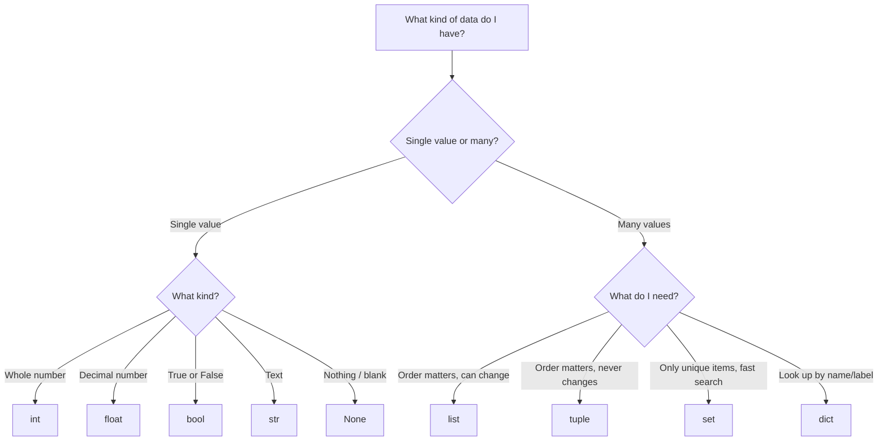

# 📦 Chapter 03: Data Types

> *"Before you can write programs, you need to understand what kind of information you're working with. Every piece of data in Python has a type — and that type determines everything about how you can use it."*

---

## 🌍 Why Do Data Types Exist?

Think about your phone's contact app. It stores:

- A person's **name** → that's text
- Their **age** → that's a whole number
- Their **balance** → that might need a decimal point
- Whether notifications are **on or off** → that's just yes or no
- A list of their **phone numbers** → multiple values together
- Their **social links** → labeled pairs like `"instagram" → "@alice"`

Now imagine Python has to store all of this. It can't treat all of them the same way. You can do math on a number, but math on someone's name makes no sense. You can search through a list, but a single number has nothing to search.

**Data types tell Python: "what is this, and what can you do with it?"**

---

## 🗺️ The Big Picture — All Data Types at a Glance

```
PYTHON DATA TYPES
│
├── NUMBERS ──────── int        → 25, -7, 1000
│                    float      → 3.14, -0.5
│                    complex    → 3+4j
│                    bool       → True, False
│
├── TEXT ─────────── str        → "hello", 'world'
│
├── COLLECTIONS ──── list       → [1, 2, 3]        ordered, changeable
│                    tuple      → (1, 2, 3)        ordered, fixed
│                    set        → {1, 2, 3}        unordered, unique only
│                    dict       → {"name": "Ali"}  key → value pairs
│
└── NOTHING ──────── None       → None             absence of value
```

```
┌───────────────────────────────────────────────────────────────────┐
│  TYPE       EXAMPLE           CHANGEABLE?   KEEPS ORDER?  UNIQUE? │
├───────────────────────────────────────────────────────────────────┤
│  int        42                ✗             –             –       │
│  float      3.14              ✗             –             –       │
│  bool       True              ✗             –             –       │
│  str        "hello"           ✗             ✓             ✗       │
│  list       [1, 2, 3]         ✓             ✓             ✗       │
│  tuple      (1, 2, 3)         ✗             ✓             ✗       │
│  set        {1, 2, 3}         ✓             ✗             ✓       │
│  dict       {"a": 1}          ✓             ✓ (Py 3.7+)   keys ✓  │
│  None       None              ✗             –             –       │
└───────────────────────────────────────────────────────────────────┘
```

**How to check the type of anything:**
```python
print(type(42))         # <class 'int'>
print(type(3.14))       # <class 'float'>
print(type("hello"))    # <class 'str'>
print(type(True))       # <class 'bool'>
print(type([1,2,3]))    # <class 'list'>
print(type(None))       # <class 'NoneType'>
```

---

## 🔢 Part 1: `int` — Whole Numbers

### What is it?

`int` stands for **integer** — a whole number with no decimal point. It can be positive, negative, or zero.

```python
age       = 25
floors    = -3        # basement floors
score     = 0
students  = 1000
big_num   = 9_999_999 # you can use underscores to make big numbers readable
                      # Python ignores them — they're just for your eyes!
```

### What Makes Python's int Special?

In most languages (like C or Java), an integer has a size limit — usually about 2 billion. Go over that, and the program crashes or wraps around to a wrong number.

**Python integers have no limit.** They can be as big as your RAM allows.

```python
# This works perfectly in Python:
really_big = 999_999_999_999_999_999_999_999_999_999
print(really_big + 1)
# 1000000000000000000000000000000  ← no crash, no wrong answer!
```

### int in Different Number Systems

Humans count in base 10 (decimal). But computers use base 2 (binary). Python lets you write numbers in different bases:

```python
decimal = 255           # base 10  — normal numbers
binary  = 0b11111111   # base 2   — starts with 0b
octal   = 0o377        # base 8   — starts with 0o
hexa    = 0xFF         # base 16  — starts with 0x

# All four of these are the same number — 255!
print(decimal == binary == octal == hexa)   # True

# Convert TO different bases:
print(bin(255))    # '0b11111111'   → binary string
print(oct(255))    # '0o377'        → octal string
print(hex(255))    # '0xff'         → hex string
```

### int Arithmetic

```python
a = 17
b = 5

print(a + b)    # 22   → addition
print(a - b)    # 12   → subtraction
print(a * b)    # 85   → multiplication
print(a ** b)   # 1419857 → power (17 to the power of 5)

# Division is where it gets interesting:
print(a / b)    # 3.4  → TRUE division → always gives a float!
print(a // b)   # 3    → FLOOR division → whole number only (cuts decimal off)
print(a % b)    # 2    → MODULO → the remainder after dividing
```

**Understanding floor division and modulo — a real example:**

```
You have 17 apples. You want to pack them into boxes of 5.

17 // 5 = 3   → you can fill 3 complete boxes
17 %  5 = 2   → you'll have 2 apples left over (the remainder)

Check: 3 boxes × 5 apples = 15 apples used + 2 leftover = 17 ✓
```

**Modulo is incredibly useful:**
```python
# Is a number even or odd?
print(10 % 2)   # 0  → 10 is EVEN (no remainder when divided by 2)
print(11 % 2)   # 1  → 11 is ODD  (1 remainder)

# Does a number divide evenly?
# If n % x == 0, then n is divisible by x
print(100 % 4)  # 0  → 100 is divisible by 4

# What's the last digit of a number?
print(12345 % 10)  # 5  → last digit is always: number % 10
```

### Useful int Operations

```python
print(abs(-42))        # 42        → absolute value (makes negative positive)
print(pow(2, 10))      # 1024      → same as 2**10
print(divmod(17, 5))   # (3, 2)    → gives BOTH floor division AND remainder at once!
```

---

## 🌊 Part 2: `float` — Decimal Numbers

### What is it?

`float` is for numbers that have a decimal point — measurements, prices, percentages, coordinates, anything that isn't a whole number.

```python
pi          = 3.14159265358979
temperature = 36.6
price       = 999.99
percentage  = 0.18          # 18%
tiny        = 0.000001
big         = 1.5e10        # scientific notation: 1.5 × 10¹⁰ = 15,000,000,000
very_small  = 2.5e-4        # 2.5 × 10⁻⁴ = 0.00025
```

### The Float Precision Problem — The Most Important Warning in Python

This is one of the first things that shocks every Python beginner. Try this:

```python
print(0.1 + 0.2)
```

You'd expect `0.3`. But Python prints: `0.30000000000000004`

**Why does this happen?**

Your computer stores numbers in binary (base 2 — only 0s and 1s). The number `0.1` looks simple in decimal, but in binary it's an infinite repeating pattern:

```
0.1 in binary = 0.00011001100110011001100110011...  (goes on forever!)
```

The computer can only store a limited number of digits, so it stores an approximation. When you do math on approximations, tiny errors appear.

It's the same as `1/3` in decimal — you can't write it exactly, so you write `0.3333...` and there's always a tiny inaccuracy.

**How to handle it:**

```python
# ❌ Never compare floats directly with ==
print(0.1 + 0.2 == 0.3)    # False  ← wrong!

# ✅ Use round() when displaying
print(round(0.1 + 0.2, 2))  # 0.3   ← correct display

# ✅ Use round() for comparisons
print(round(0.1 + 0.2, 10) == 0.3)   # True

# ✅ For financial calculations — use the decimal module (later chapters)
```

### Important float Facts

```python
# Division always gives a float — even if the result is whole:
print(10 / 2)     # 5.0  ← float, not 5!
print(type(10/2)) # <class 'float'>

# Mixing int and float → result is always float:
print(5 + 2.0)    # 7.0  ← int + float = float

# Check if a float is actually a whole number:
print((7.0).is_integer())   # True   → 7.0 is a whole number
print((7.5).is_integer())   # False  → 7.5 is not

# Float limits:
print(1.8e308)     # inf  → beyond float's maximum → becomes infinity
print(-1.8e308)    # -inf → negative infinity

# Special float values:
positive_infinity = float('inf')
negative_infinity = float('-inf')
not_a_number      = float('nan')   # result of invalid operations like 0/0
```

### Float Rounding

```python
print(round(3.14159, 2))    # 3.14       → round to 2 decimal places
print(round(3.14159, 0))    # 3.0        → round to 0 decimal places (still float)
print(round(2.5))           # 2          → Python uses banker's rounding!
print(round(3.5))           # 4          → rounds to nearest EVEN number

# round() for negative decimal places:
print(round(1234, -2))      # 1200       → round to nearest hundred
print(round(1678, -2))      # 1700
```

---

## ✅ Part 3: `bool` — True or False

### What is it?

`bool` (short for Boolean) has exactly two values: `True` or `False`. It's used for yes/no decisions — is the user logged in? Is the password correct? Is the list empty?

```python
is_logged_in    = True
is_admin        = False
has_permission  = True
is_raining      = False
```

### The Surprising Truth: bool is an Integer!

This is a fascinating Python fact. `bool` is actually a **subtype of `int`**. Under the hood:

```python
True  == 1    # True
False == 0    # True

print(True + True)      # 2   ← yes, you can add booleans!
print(True + False)     # 1
print(True * 10)        # 10
print(False * 10)       # 0

# This is actually USEFUL:
exam_results = [True, False, True, True, False, True]
passed = sum(exam_results)   # counts True as 1, False as 0
print(passed)                # 4  ← 4 students passed!
```

### Truthiness — What "Acts Like" True or False

Python doesn't just use the words `True` and `False`. Many values can act as truthy or falsy in a condition.

```
┌───────────────────────────────────────────────────────────┐
│  FALSY — these all behave like False in conditions        │
│                                                           │
│   0        the number zero (int)                         │
│   0.0      the number zero (float)                       │
│   ""       an empty string                               │
│   []       an empty list                                 │
│   {}       an empty dict                                 │
│   ()       an empty tuple                               │
│   set()    an empty set                                 │
│   None     the absence of value                         │
│   False    False itself                                 │
│                                                           │
│  TRUTHY — everything else, including:                     │
│   1  -1  42   any non-zero number                        │
│   "a"  " "    any non-empty string (even just a space!)  │
│   [0]         a list with items (even if items are falsy)│
│   {"a":1}     a non-empty dict                          │
└───────────────────────────────────────────────────────────┘
```

```python
# In an 'if' condition, Python checks truthiness:
username = ""
if username:
    print("Hello,", username)
else:
    print("Please enter a username")   # ← this runs, because "" is falsy

items = [1, 2, 3]
if items:
    print("Cart has items")    # ← this runs, because non-empty list is truthy

# Explicitly convert anything to bool:
print(bool(0))       # False
print(bool(42))      # True
print(bool(""))      # False
print(bool("hi"))    # True
print(bool([]))      # False
print(bool([0]))     # True  ← list has one item, even if that item is 0!
```

---

# 🔤 Part 4: `str` — Text

### What is it?

`str` (string) stores text — any sequence of characters: letters, numbers, spaces, symbols, emojis. Strings are **immutable** — once created, they cannot be changed.

### Creating Strings

```python
single   = 'hello'
double   = "hello"                   # same thing, both work
multi    = """This string
spans multiple
lines"""

name = "Alice"
age  = 25

# f-strings — the best way to embed values in text (Python 3.6+)
message = f"My name is {name} and I am {age} years old."
print(message)   # My name is Alice and I am 25 years old.

# You can put any expression inside {}:
print(f"Next year I'll be {age + 1}")        # Next year I'll be 26
print(f"2 + 2 = {2 + 2}")                   # 2 + 2 = 4
print(f"Pi is about {3.14159:.2f}")          # Pi is about 3.14  (2 decimal places)
print(f"Total: {1234567:,}")                 # Total: 1,234,567  (comma separator)
```

### Strings are Sequences — Indexing & Slicing

A string is like a **train of carriages**. Each carriage holds one character and has a number (index) starting from 0.

```
  "P  y  t  h  o  n"
   0  1  2  3  4  5     ← positive index (left to right)
  -6 -5 -4 -3 -2 -1     ← negative index (right to left)
```

```python
s = "Python"

# Indexing — get ONE character:
print(s[0])     # 'P'    first character
print(s[1])     # 'y'
print(s[-1])    # 'n'    last character
print(s[-2])    # 'o'    second from last

# Slicing — get a RANGE of characters:
# Syntax: s[start : stop : step]
# start is INCLUDED, stop is EXCLUDED

print(s[0:3])   # 'Pyt'   → characters at index 0, 1, 2
print(s[2:5])   # 'tho'   → characters at index 2, 3, 4
print(s[2:])    # 'thon'  → from index 2 to the END
print(s[:4])    # 'Pyth'  → from the START to index 3
print(s[:])     # 'Python' → entire string (copy)
print(s[::-1])  # 'nohtyP' → reversed! (step of -1 goes backwards)
print(s[::2])   # 'Pto'   → every 2nd character
```

**Why does `s[0:3]` give characters 0, 1, 2 — not 0, 1, 2, 3?**

Think of indices as positions BETWEEN characters, not on them:

```
 P    y    t    h    o    n
|    |    |    |    |    |    |
0    1    2    3    4    5    6

s[0:3] means: from position 0 to position 3
= 'P', 'y', 't'   (everything between 0 and 3)
```

### String Methods — The Toolbox

Strings come with dozens of built-in tools. Here are the most important ones:

```python
s = "  Hello, World!  "

# ── CLEANING ──────────────────────────────────────────
s.strip()           # "Hello, World!"     removes spaces from both ends
s.lstrip()          # "Hello, World!  "   removes only from left
s.rstrip()          # "  Hello, World!"   removes only from right

# ── CASE ──────────────────────────────────────────────
"hello".upper()         # "HELLO"
"HELLO".lower()         # "hello"
"hello world".title()   # "Hello World"    first letter of each word
"hello".capitalize()    # "Hello"          only very first letter

# ── SEARCHING ─────────────────────────────────────────
"hello world".find("world")      # 6    → index where it starts
                                 #       returns -1 if NOT found
"hello world".find("xyz")        # -1   → not found
"hello world".count("l")         # 3    → how many times 'l' appears
"hello".startswith("hel")        # True
"hello".endswith("llo")          # True

# Check if something is IN the string (the easiest way):
print("world" in "hello world")  # True
print("xyz" in "hello world")    # False

# ── REPLACING & SPLITTING ─────────────────────────────
"hello world".replace("world", "python")   # "hello python"
"a,b,c,d".split(",")   # ['a', 'b', 'c', 'd']   → splits into list
"hello world".split()  # ['hello', 'world']       → splits on whitespace

# Joining — the OPPOSITE of split:
words = ["hello", "world", "python"]
" ".join(words)         # "hello world python"
",".join(words)         # "hello,world,python"
"-".join(words)         # "hello-world-python"

# ── CHECKING CONTENT ──────────────────────────────────
"abc".isalpha()     # True   → all letters?
"123".isdigit()     # True   → all digits?
"abc123".isalnum()  # True   → all letters OR digits?
"   ".isspace()     # True   → all whitespace?
"abc".islower()     # True   → all lowercase?
"ABC".isupper()     # True   → all uppercase?
```

### Strings are Immutable — What That Means

```python
s = "hello"

# You CANNOT change a character:
# s[0] = "H"   ← this would give a TypeError!

# Instead, you create a NEW string:
s = "H" + s[1:]    # "Hello"  — new string created
s = s.replace("h", "H")   # also creates a new string

# Every string operation RETURNS a new string — the original never changes.
original = "hello"
result   = original.upper()
print(original)   # "hello"  ← unchanged!
print(result)     # "HELLO"  ← the new string
```

### String Length and Counting

```python
s = "Python"
print(len(s))   # 6  → len() works on ALL sequences (str, list, tuple, etc.)

sentence = "The quick brown fox"
print(len(sentence))   # 19   → includes spaces!

# Count occurrences of a specific character:
print(sentence.count("o"))   # 2   → 'brown' and 'fox'
print(sentence.count("the")) # 0   → case-sensitive! 'The' ≠ 'the'
print(sentence.lower().count("the"))  # 1  → case-insensitive count
```

---

# 📋 Part 5: `list` — Ordered Collection

### What is it?

A list is an **ordered, changeable collection** that can hold any types of data — even mixed types, even other lists.

Think of a list as a **numbered locker row**:

```
Index:  [  0   ]  [  1   ]  [  2   ]  [  3   ]  [  4   ]
        ["apple"] ["banana"]["cherry"]["date"] ["elderberry"]

- Each locker has a NUMBER (index), starting from 0
- You can OPEN a locker, PUT something in, TAKE something out
- The ORDER is preserved
- Lockers can hold DIFFERENT things
```

### Creating Lists

```python
empty      = []
fruits     = ["apple", "banana", "cherry"]
numbers    = [10, 20, 30, 40, 50]
mixed      = ["Alice", 25, True, 3.14]       # ← different types in one list!
nested     = [[1, 2, 3], [4, 5, 6]]          # ← list inside a list
from_range = list(range(5))                   # [0, 1, 2, 3, 4]
```

### Accessing Items (Same as Strings)

```python
fruits = ["apple", "banana", "cherry", "date", "elderberry"]

print(fruits[0])    # "apple"        first item
print(fruits[-1])   # "elderberry"   last item
print(fruits[1:3])  # ["banana", "cherry"]   slicing works the same!
print(fruits[::-1]) # reversed list

# Unlike strings — you CAN change list items:
fruits[0] = "avocado"
print(fruits)  # ["avocado", "banana", "cherry", "date", "elderberry"]
```

### Adding Items

```python
fruits = ["apple", "banana"]

fruits.append("cherry")        # add ONE item to the END
print(fruits)  # ["apple", "banana", "cherry"]

fruits.insert(1, "avocado")    # insert at a specific POSITION
print(fruits)  # ["apple", "avocado", "banana", "cherry"]

fruits.extend(["date", "fig"]) # add MULTIPLE items from another list
print(fruits)  # ["apple", "avocado", "banana", "cherry", "date", "fig"]

# What's the difference between append and extend?
# append([4,5]) adds the LIST ITSELF as one item → [1,2,3, [4,5]]
# extend([4,5]) adds each ITEM separately       → [1,2,3, 4, 5]

a = [1, 2, 3]
b = [1, 2, 3]
a.append([4, 5])   # a = [1, 2, 3, [4, 5]]  ← nested!
b.extend([4, 5])   # b = [1, 2, 3, 4, 5]    ← flat
```

### Removing Items

```python
fruits = ["apple", "banana", "cherry", "banana", "date"]

fruits.remove("banana")       # removes the FIRST "banana" found by value
print(fruits)  # ["apple", "cherry", "banana", "date"]

last = fruits.pop()           # removes & returns the LAST item
print(last)    # "date"
print(fruits)  # ["apple", "cherry", "banana"]

first = fruits.pop(0)         # removes & returns item at index 0
print(first)   # "apple"

del fruits[0]                 # delete by index (no return value)
print(fruits)  # ["banana"]

fruits.clear()                # remove EVERYTHING — empty list remains
print(fruits)  # []
```

### Useful List Operations

```python
numbers = [3, 1, 4, 1, 5, 9, 2, 6, 5, 3]

print(len(numbers))       # 10     → how many items?
print(sum(numbers))       # 39     → add them all up (numbers only)
print(min(numbers))       # 1      → smallest
print(max(numbers))       # 9      → largest
print(numbers.count(1))   # 2      → how many times does 1 appear?
print(numbers.index(5))   # 4      → index of FIRST occurrence of 5

# Sorting:
numbers.sort()            # sorts IN PLACE — changes the original list!
print(numbers)            # [1, 1, 2, 3, 3, 4, 5, 5, 6, 9]

numbers.sort(reverse=True) # sort in descending order
print(numbers)            # [9, 6, 5, 5, 4, 3, 3, 2, 1, 1]

# sorted() creates a NEW list — original stays the same:
original = [3, 1, 4, 1, 5]
new_sorted = sorted(original)
print(original)    # [3, 1, 4, 1, 5]  ← unchanged!
print(new_sorted)  # [1, 1, 3, 4, 5]  ← new sorted copy

# Reverse:
numbers.reverse()          # reverses IN PLACE
```

### Checking Membership

```python
fruits = ["apple", "banana", "cherry"]

print("apple" in fruits)    # True
print("mango" in fruits)    # False
print("mango" not in fruits) # True
```

### Copying Lists — The Trap!

```python
# WRONG WAY — this does NOT copy the list:
a = [1, 2, 3]
b = a          # b is NOT a copy — both a and b point to the SAME list!

b.append(4)
print(a)   # [1, 2, 3, 4]   ← a changed too! Surprised?

# This happens because lists are mutable objects in memory.
# When you do b = a, you're saying "b also points to that same list"
# You're NOT creating a second list.

# CORRECT WAYS to make a real copy:
a = [1, 2, 3]
b = a.copy()   # ✅ method 1 — creates a new independent list
c = a[:]       # ✅ method 2 — slice the whole list (makes a copy)
d = list(a)    # ✅ method 3 — create new list from a

b.append(4)
print(a)   # [1, 2, 3]   ← a is unchanged now!
print(b)   # [1, 2, 3, 4]
```

---

# 📦 Part 6: `tuple` — The Sealed List

### What is it?

A tuple is exactly like a list, **except you cannot change it after creation**. No adding, no removing, no modifying.

```python
coordinates = (10.5, 25.3)
rgb_color   = (255, 128, 0)
months      = ("Jan", "Feb", "Mar", "Apr", "May", "Jun",
               "Jul", "Aug", "Sep", "Oct", "Nov", "Dec")
```

### Creating Tuples

```python
t = (1, 2, 3)         # with parentheses
t = 1, 2, 3           # parentheses are OPTIONAL — still a tuple!

# Single item tuple — the comma is REQUIRED!
single = (42,)        # ← this IS a tuple: (42,)
not_tuple = (42)      # ← this is just the number 42! Parentheses don't make tuples!
print(type(single))   # <class 'tuple'>
print(type(not_tuple)) # <class 'int'>  ← surprise!
```

### Accessing Tuples (Same as Lists)

```python
months = ("Jan", "Feb", "Mar", "Apr", "May", "Jun")

print(months[0])    # "Jan"
print(months[-1])   # "Jun"
print(months[1:4])  # ("Feb", "Mar", "Apr")
print(len(months))  # 6

# But this would fail:
# months[0] = "January"   ← TypeError: tuple does not support item assignment
```

### Tuple Unpacking — The Real Power

Tuple unpacking is how you assign multiple variables from a tuple at once. It's clean, readable, and very Pythonic:

```python
coordinates = (10, 20)
x, y = coordinates     # unpack — x gets 10, y gets 20
print(x)   # 10
print(y)   # 20

# Works with any tuple:
r, g, b = (255, 128, 0)   # r=255, g=128, b=0
first, second, third = ("gold", "silver", "bronze")

# Swap two variables using tuples:
a = 10
b = 20
a, b = b, a    # this works via tuple! Python creates (b, a) then unpacks it
print(a)  # 20
print(b)  # 10
```

### When to Use Tuple vs List?

```
Use a LIST when:
  → You need to add or remove items
  → The data is a collection that will grow or change
  → Order matters and data will be modified

Use a TUPLE when:
  → Data should NEVER change (coordinates, RGB values, dates)
  → You're returning multiple values and want clarity
  → You need to use it as a dictionary key (lists cannot be keys!)

Memory note: Tuples are slightly FASTER and use slightly LESS memory than lists.
Python can optimise them better because they never change.
```

---

### Memory Layout: List vs Tuple

The memory difference between list and tuple is more than just mutability:

```
list  = dynamic array of POINTERS
        ┌─────┬─────┬─────┬─────┬─────┐
        │ptr 0│ptr 1│ptr 2│ ... │extra│  ← over-allocates to amortize append cost
        └─────┴─────┴─────┴─────┴─────┘
              ↓     ↓     ↓
           heap  heap  heap  (actual objects)

tuple = fixed-size array of POINTERS
        ┌─────┬─────┬─────┐
        │ptr 0│ptr 1│ptr 2│  ← exactly the right size, no extra
        └─────┴─────┴─────┘
```

Practical implications:

- **Tuple creation is faster** — no size calculation or over-allocation
- **Tuple uses less memory** — no extra buffer slots
- **List has O(1) amortized append** — pre-allocates extra space
- **Tuples signal intent** — "this data does not change" (readable, prevents bugs)

```python
import sys
a = [1, 2, 3, 4, 5]
b = (1, 2, 3, 4, 5)
print(sys.getsizeof(a))   # 104 bytes  (extra allocation)
print(sys.getsizeof(b))   # 80 bytes   (exact size)
```

---

# 🎯 Part 7: `set` — Only Unique Items

### What is it?

A set is a collection that **automatically removes duplicates**. It also has no order — items are stored internally in a way that makes lookup extremely fast.

Think of a set as a **bag where duplicates magically disappear**:

```
You put in:  [1, 2, 2, 3, 3, 3, 4]
You get:     {1, 2, 3, 4}          ← duplicates gone!
```

### Creating Sets

```python
s = {1, 2, 3, 4}
s = {1, 2, 2, 3, 3, 3}    # → {1, 2, 3}  duplicates removed automatically!

# From a list — great for removing duplicates:
s = set([1, 2, 2, 3, 3])   # → {1, 2, 3}

# From a string — unique characters only:
s = set("hello")            # → {'h', 'e', 'l', 'o'}  (only one 'l'!)

# IMPORTANT: empty set must use set(), NOT {}:
empty_set  = set()   # ✅ this is an empty set
empty_dict = {}      # ❌ this is an empty DICTIONARY, not a set!
```

### Adding and Removing

```python
colors = {"red", "green", "blue"}

colors.add("yellow")        # add one item
print(colors)   # {'red', 'green', 'blue', 'yellow'}  (order may vary!)

colors.discard("purple")    # remove — NO error even if "purple" doesn't exist
colors.remove("red")        # remove — raises KeyError if item not in set
colors.pop()                # remove and return a RANDOM item (order is not defined)

# Check membership — this is where sets SHINE:
print("green" in colors)   # True   → very fast! O(1)
print("pink" in colors)    # False
```

### The Speed Advantage of Sets

This is the most important practical reason to use sets:

```python
# Imagine you have 1 million items and want to check if something exists:

# With a LIST:
big_list = list(range(1_000_000))
999_999 in big_list    # Python has to check every single item... slow!

# With a SET:
big_set = set(range(1_000_000))
999_999 in big_set     # Python jumps straight to it using math... instant!

# A set lookup is O(1) — constant time regardless of size
# A list lookup is O(n) — slower as the list grows
```

### Set Math — Union, Intersection, Difference

Sets support mathematical operations that are incredibly useful:

```python
python_students  = {"Alice", "Bob", "Charlie", "Diana"}
java_students    = {"Bob", "Eve", "Charlie", "Frank"}

# UNION — everyone who studies either Python OR Java (or both):
all_students = python_students | java_students
print(all_students)   # {'Alice', 'Bob', 'Charlie', 'Diana', 'Eve', 'Frank'}

# INTERSECTION — students who study BOTH Python AND Java:
both = python_students & java_students
print(both)    # {'Bob', 'Charlie'}

# DIFFERENCE — students in Python but NOT in Java:
only_python = python_students - java_students
print(only_python)    # {'Alice', 'Diana'}

# SYMMETRIC DIFFERENCE — students in one course but NOT both:
exclusive = python_students ^ java_students
print(exclusive)    # {'Alice', 'Diana', 'Eve', 'Frank'}
```

```
Visual diagram:
      Python          Java
  ┌───────────────────────────┐
  │  Alice   ┌──────┐  Eve   │
  │  Diana   │ Bob  │  Frank │
  │          │Charlie        │
  └──────────┴──────┴────────┘

  |  means union (everything)
  & means intersection (only middle)
  - means difference (one side only)
```

---

### Why Sets Require Hashable Elements — The Hash Table Internals

A set stores elements in a **hash table** — an array where the position of each element
is determined by its hash value.

```
set = {10, 25, 42, 7}

Hash table (simplified, size=8):
  slot 0: empty
  slot 1: empty
  slot 2: 10  (10 % 8 = 2)
  slot 3: 11  (not present)
  slot 4: empty
  slot 5: 13  (not present)
  slot 6: 42  (42 % 8 = 2 → collision → probe to slot 6)
  slot 7: 7   (7 % 8 = 7)
  slot 1: 25  (25 % 8 = 1)
```

**Why lookup is O(1):**
To check if `42` is in the set:
1. Compute `hash(42)` → fixed position in array
2. Check that slot → found or not found
3. One or a few operations — regardless of set size

**Why elements must be hashable:**
The hash determines WHERE in the table to store/look up the element.
Lists are mutable — if you mutate a list after adding it to a set, its hash would change,
making it unfindable. That's why lists (mutable) cannot be set elements.

```python
s = {1, 2, 3}         # ints: hashable ✓
s = {(1, 2), (3, 4)}  # tuples of ints: hashable ✓ (tuples are immutable)
s = {[1, 2]}          # TypeError: unhashable type: 'list'
```

The same rule applies to dict keys.

---

# 🗂️ Part 8: `dict` — Key-Value Pairs

### What is it?

A dictionary stores **pairs of information** — a key and its value. You look up a key, and instantly get the value. Like a real dictionary where you look up a word to get its meaning.

```
A real dictionary:        A Python dict:
"apple" → "a fruit"      "name"   → "Alice"
"run"   → "to move fast" "age"    → 25
"code"  → "instructions" "city"   → "Mumbai"
```

### Why Dictionaries are Special

```
List:   you look things up by POSITION (index 0, 1, 2...)
Dict:   you look things up by NAME (any key you choose)
```

Imagine storing information about a student:

```python
# With a list — confusing, what does each position mean?
student = ["Alice", 25, "Computer Science", 8.7]
print(student[2])    # what is this? You have to remember index 2 = subject

# With a dict — clear and self-documenting:
student = {
    "name":    "Alice",
    "age":     25,
    "subject": "Computer Science",
    "gpa":     8.7
}
print(student["subject"])   # "Computer Science"  ← obvious what you're getting!
```

### Creating Dictionaries

```python
# Method 1: curly braces with key: value pairs
person = {
    "name":  "Alice",
    "age":   25,
    "city":  "Mumbai"
}

# Method 2: dict() with keyword arguments
person = dict(name="Alice", age=25, city="Mumbai")

# Empty dictionary:
empty = {}
empty = dict()
```

### Accessing Values

```python
person = {"name": "Alice", "age": 25, "city": "Mumbai"}

# Method 1: Square brackets — gives KeyError if key doesn't exist!
print(person["name"])    # "Alice"
# print(person["phone"])  # ❌ KeyError: 'phone'

# Method 2: .get() — safe, returns None if key doesn't exist:
print(person.get("name"))      # "Alice"
print(person.get("phone"))     # None    ← no crash!
print(person.get("phone", "Not provided"))  # "Not provided"  ← custom default

# RULE: Use .get() when a key might not exist. Use [] only when you're sure it exists.
```

### Adding, Updating, Removing

```python
person = {"name": "Alice", "age": 25}

# Add a new key:
person["email"] = "alice@example.com"
print(person)   # {"name":"Alice","age":25,"email":"alice@example.com"}

# Update existing key:
person["age"] = 26
print(person["age"])   # 26

# Update multiple at once:
person.update({"age": 27, "city": "Delhi"})

# Remove a key:
del person["email"]                     # deletes — KeyError if missing
age = person.pop("age")                 # removes AND returns the value
age = person.pop("phone", None)         # safe pop — returns None if missing

# Remove everything:
person.clear()
```

### Iterating (Looping) Over a Dict

```python
scores = {"Alice": 95, "Bob": 87, "Charlie": 92}

# Loop through KEYS:
for name in scores:
    print(name)          # Alice, Bob, Charlie

# Loop through VALUES:
for score in scores.values():
    print(score)         # 95, 87, 92

# Loop through BOTH key and value (most common):
for name, score in scores.items():
    print(f"{name}: {score}")
# Alice: 95
# Bob: 87
# Charlie: 92
```

### Checking if a Key Exists

```python
scores = {"Alice": 95, "Bob": 87}

print("Alice" in scores)      # True   → checks KEYS by default
print("Charlie" in scores)    # False
print("Charlie" not in scores) # True
print(95 in scores.values())   # True   → checks values (need .values())
```

### Nested Dictionaries

Dictionaries can contain other dictionaries — great for structured data:

```python
school = {
    "Alice": {
        "grade": 10,
        "subjects": ["Math", "Science", "English"],
        "gpa": 9.2
    },
    "Bob": {
        "grade": 11,
        "subjects": ["Commerce", "Economics"],
        "gpa": 8.5
    }
}

# Accessing nested data:
print(school["Alice"]["gpa"])          # 9.2
print(school["Bob"]["subjects"][0])    # "Commerce"
```

---

---

### Dict Ordering Guarantee (Python 3.7+)

Since Python 3.7, dicts are guaranteed to maintain **insertion order**.

```python
d = {}
d['c'] = 3
d['a'] = 1
d['b'] = 2

for key in d:
    print(key)   # c, a, b — insertion order preserved
```

**Before Python 3.7:** Order was an implementation detail — you couldn't rely on it.
**Python 3.7+:** Insertion order is part of the language spec.

**Why it was added:**
Python's dict was re-implemented in CPython 3.6 to be both faster and more compact.
The new implementation naturally preserved insertion order as a side effect.
It was made official in Python 3.7.

**When it matters:**

```python
# Building an ordered response:
response = {"status": "ok", "data": result, "timestamp": now}
# Order in JSON output will match insertion order — predictable API responses

# Configuration priority:
config = {"host": "localhost", "port": 8080, "debug": True}
# First key is first key — readability and predictability
```

**Note:** If you need sorted order, use `sorted(d.keys())` — dict preserves insertion order,
not sort order.

---

## ❓ Part 9: `None` — The Intentional Blank

### What is it?

`None` represents **the absence of a value** — not zero, not an empty string, not False. It's Python's way of saying "nothing here, intentionally."

```python
result = None          # no result yet
phone  = None          # person has no phone number on file

# Checking for None — always use 'is', not '==':
if result is None:
    print("No result available")

if phone is not None:
    print("Phone:", phone)
else:
    print("Phone not provided")
```

**Why `is` instead of `==`?**

`None` is a special singleton — there's only ONE `None` object in all of Python. `is` checks if it's that exact object. It's more precise and is the Pythonic way.

```python
# When does a variable become None?
# 1. You set it explicitly:
x = None

# 2. A function that has no return statement returns None:
result = print("hello")   # print() doesn't return anything
print(result)              # None  ← because print() has no return value

# 3. .get() on a missing dict key:
d = {"a": 1}
print(d.get("b"))   # None
```

---

## 🔄 Part 10: Type Conversion

### Why Convert Types?

Sometimes data comes in one form and you need it in another:
- User types a number with `input()` → it comes as a string, you need an int
- You want to display a number inside a sentence → number to string
- A list has duplicates and you want them removed → list to set

### Common Conversions

```python
# → int
int("42")        # 42         string to int
int(3.9)         # 3          float to int (TRUNCATES — cuts off decimal, doesn't round!)
int(True)        # 1          bool to int
int(False)       # 0

# ⚠️ These will CRASH:
# int("hello")   → ValueError: invalid literal
# int("3.14")    → ValueError: use float("3.14") first!

# → float
float("3.14")    # 3.14       string to float
float(42)        # 42.0       int to float
float(True)      # 1.0

# → str
str(42)          # "42"       int to string
str(3.14)        # "3.14"     float to string
str(True)        # "True"     bool to string
str([1,2,3])     # "[1, 2, 3]" list to string representation

# → bool
bool(0)          # False
bool(1)          # True
bool("")         # False
bool("hello")    # True
bool([])         # False
bool([1,2])      # True

# → list
list("Python")   # ['P','y','t','h','o','n']   string → list of chars
list((1,2,3))    # [1, 2, 3]                   tuple → list
list({1,2,3})    # [1, 2, 3]  (order may vary) set → list

# → tuple
tuple([1,2,3])   # (1, 2, 3)   list → tuple
tuple("abc")     # ('a','b','c')

# → set (removes duplicates)
set([1,2,2,3])   # {1, 2, 3}
set("hello")     # {'h','e','l','o'}
```

### The Most Common Conversion — Input from User

```python
# input() ALWAYS returns a string — no matter what the user types!
name = input("Enter your name: ")   # string — correct, names are text
age  = input("Enter your age: ")    # ← this is a string "25", not the number 25!

# This will CRASH:
next_year = age + 1   # ❌ TypeError: can't add str and int

# FIX — convert immediately:
age = int(input("Enter your age: "))   # ✅ now it's an integer
next_year = age + 1   # ✅ works!
```

---

## 🔄 How to Choose the Right Type



---

## ⚠️ The Most Important Gotchas

```python
# 1. {} is an empty DICT, not empty set
empty_dict = {}       # dict!
empty_set  = set()    # correct way for empty set

# 2. Single-item tuple NEEDS a trailing comma
just_42    = (42)     # this is the int 42, NOT a tuple
real_tuple = (42,)    # this IS a tuple

# 3. Copying a list
b = a        # NOT a copy — both point to same list!
b = a.copy() # actual copy

# 4. int() truncates, doesn't round
int(3.9)     # 3, not 4!
int(3.1)     # 3
round(3.9)   # 4  ← use round() when you want rounding

# 5. input() always returns a string
age = input("Age: ")    # "25"  → string!
age = int(input("Age: ")) # 25 → int ✅

# 6. Float comparison trap
0.1 + 0.2 == 0.3   # False! Use round() or just avoid == with floats

# 7. list.sort() vs sorted()
lst.sort()       # changes the list, returns None
sorted(lst)      # returns a new list, original untouched
```

---

## 🎬 Chapter Summary

```
You now know all of Python's core data types:
━━━━━━━━━━━━━━━━━━━━━━━━━━━━━━━━━━━━━━━━━━━━━━━━━━━━━━━━━━━━━
  int     Whole numbers, any size, floor div //, modulo %
  float   Decimals, precision trap, use round() wisely
  bool    True/False, subtype of int, truthiness concept
  str     Text, immutable, indexing/slicing, 20+ methods
  list    Ordered, mutable, any types, append/pop/sort
  tuple   Ordered, immutable, unpacking, use as dict key
  set     Unique items, fast O(1) search, set math
  dict    Key-value pairs, .get() is your friend, nested dicts
  None    Intentional emptiness, use 'is' to check
━━━━━━━━━━━━━━━━━━━━━━━━━━━━━━━━━━━━━━━━━━━━━━━━━━━━━━━━━━━━━
```

---

## 🧭 Navigation

| | |
|---|---|
| ⬅️ Previous | [02 — Control Flow](../02_control_flow/README.md) |
| 💻 Practice | [practice.py](./practice.py) |
| 🌍 Examples | [examples.py](./examples.py) |
| 🎤 Interview | [interview.md](./interview.md) |
| ⚡ Cheatsheet | [cheatsheet.md](./cheatsheet.md) |
| ➡️ Next | [04 — Functions](../04_functions/README.md) |
| 🏠 Home | [python-complete-mastery](../README.md) |

---

**[🏠 Back to README](../README.md)**

**Prev:** [← Control Flow — Interview Q&A](../02_control_flow/interview.md) &nbsp;|&nbsp; **Next:** [Complete Guide →](./complete_guide.md)

**Related Topics:** [Complete Guide](./complete_guide.md) · [Complexity Analysis](./complexity_analysis.md) · [Cheat Sheet](./cheetsheet.md) · [Complexity Analysis Interview](./complexity_analysis_interview.md) · [Interview Q&A](./interview.md)
