**Fundamentals to Production Engineering · Progressive Learning · Interview Ready**

## 🔥 What Is This?

A complete, structured Python mastery system — from absolute basics to production-grade engineering patterns. Every module has theory, practice files with heavy inline comments, and interview Q&A. Practice files are structured with progressive learning: **Part 1** uses only concepts from that module level, **Part 2** revisits after later modules unlock new patterns.

> Not just syntax. Not just notes. A system for thinking like a Python professional.

## 🗺️ Section Overview

| # | Section | Topics | Level | Time |
|---|---------|--------|-------|------|
| 🟢 **01–06** | [Core Python](#section-1-core-python) | Fundamentals, Control Flow, Data Types, Functions, OOP, Exceptions | Beginner–Intermediate | 20–25 hrs |
| 🔵 **07–15** | [Advanced Python](#section-2-advanced-python) | Modules, File I/O, Logging, Decorators, Generators, Concurrency, Memory | Intermediate–Advanced | 25–30 hrs |
| 🟣 **16–21** | [Architecture & Production](#section-3-architecture--production) | Design Patterns, Testing, Performance, System Design, Data Engineering | Advanced–Expert | 25–30 hrs |
| 🎯 **99** | [Interview Master](#section-4-interview-master) | 0–2 yrs, 3–5 yrs, Scenario-based, Edge Cases | All levels | 10–15 hrs |

**Total: ~80–100 hours of structured learning**

## 🛤️ Choose Your Path

<strong>🟢 Beginner Path — I'm new to Python (Start here!)</strong>

> Goal: Understand how Python truly works — not just syntax, but why.

| Step | Module | What You'll Learn |
|------|--------|-------------------|
| 1 | [Python Fundamentals](./01_python_fundamentals/theory.md) | Variables, types, references, name binding, memory model |
| 2 | [Control Flow](./02_control_flow/theory.md) | if/elif/else, loops, break/continue, loop-else, comprehensions |
| 3 | [Data Types](./03_data_types/theory.md) | Lists, dicts, sets, tuples — creation, operations, when to use each |
| 4 | [Functions](./04_functions/theory.md) | def, args, *args, **kwargs, default values, scope |
| 5 | [OOP Part 1](./05_oops/theory_part1.md) | Classes, `__init__`, methods, inheritance, `super()` |
| 6 | [Exceptions](./06_exceptions_error_handling/theory.md) | try/except/finally, custom exceptions, best practices |

**Practice first:** Each module has a `practice.py` file — run it, read the comments, modify it.

<strong>🔵 Intermediate Path — I know basics, want real engineering skills</strong>

> Goal: Write Python that behaves correctly at scale and in production.

| Step | Module | What You'll Learn |
|------|--------|-------------------|
| 7 | [Modules & Packages](./07_modules_packages/theory.md) | import system, __init__.py, relative imports, packaging |
| 8 | [File Handling](./08_file_handling/theory.md) | open(), pathlib, CSV, JSON, binary files |
| 9 | [Logging & Debugging](./09_logging_debugging/theory.md) | logging module, handlers, formatters, pdb |
| 10 | [Decorators](./10_decorators/theory.md) | @wraps, stacked decorators, class decorators, parametrized |
| 11 | [Generators & Iterators](./11_generators_iterators/theory.md) | yield, send(), generator pipelines, __iter__/__next__ |
| 12 | [Context Managers](./12_context_managers/theory.md) | with, __enter__/__exit__, contextlib.contextmanager |

<strong>🔴 Advanced Path — I want concurrency and production patterns</strong>

> Goal: Write concurrent, performant, production-grade Python systems.

| Step | Module | What You'll Learn |
|------|--------|-------------------|
| 13 | [Concurrency](./13_concurrency/theory.md) | GIL, threading, multiprocessing, asyncio, executors |
| 14 | [Memory Management](./01.1_memory_management/theory.md) | Reference counting, garbage collection, __slots__, memory profiling |
| 15 | [Advanced Python](./15_advanced_python/theory.md) | Metaclasses, descriptors, __class_getitem__, protocols |
| 16 | [Design Patterns](./16_design_patterns/theory.md) | Singleton, Factory, Observer, Strategy — with Python implementations |
| 17 | [Testing](./17_testing/theory.md) | pytest, fixtures, mocking, parametrize, TDD, integration tests |
| 18 | [Performance Optimization](./18_performance_optimization/profiling.md) | cProfile, timeit, __slots__, algorithm complexity, memory |

<strong>🟣 Production Path — I want system design and data engineering</strong>

> Goal: Think like a production engineer — design systems, build pipelines, handle scale.

| Step | Module | What You'll Learn |
|------|--------|-------------------|
| 19 | [Production Best Practices](./19_production_best_practices/project_structure.md) | Project layout, config management, 12-factor app |
| 20 | [System Design with Python](./20_system_design_with_python/theory.md) | Caching patterns, rate limiting, circuit breakers |
| 21 | [Data Engineering](./21_data_engineering_applications/theory.md) | API collection, file pipelines, ETL, streaming |

## 📚 Full Curriculum

<strong>🟢 Section 1 — Core Python (Modules 01–06)</strong>

| Module | Theory | Practice | Interview |
|--------|--------|----------|-----------|
| 01 · Python Fundamentals | [📖](./01_python_fundamentals/theory.md) | [practice.py](./01_python_fundamentals/practice.py) · [edge_cases.py](./01_python_fundamentals/edge_cases.py) | — |
| 02 · Control Flow | [📖](./02_control_flow/theory.md) | [practice.py](./02_control_flow/practice.py) · [pattern_programs.py](./02_control_flow/pattern_programs.py) | — |
| 03 · Data Types | [📖](./03_data_types/theory.md) | [list_practice.py](./03_data_types/list_practice.py) · [dict_practice.py](./03_data_types/dict_practice.py) · [set_practice.py](./03_data_types/set_practice.py) · [tuple_practice.py](./03_data_types/tuple_practice.py) | — |
| 04 · Functions | [📖](./04_functions/theory.md) | [practice.py](./04_functions/practice.py) | — |
| 05 · OOP | [📖](./05_oops/theory_part1.md) | [practice.py](./05_oops/practice.py) | — |
| 06 · Exceptions | [📖](./06_exceptions_error_handling/theory.md) | — | — |

<strong>🔵 Section 2 — Advanced Python (Modules 07–15)</strong>

| Module | Theory | Practice |
|--------|--------|----------|
| 07 · Modules & Packages | [📖](./07_modules_packages/theory.md) | — |
| 08 · File Handling | [📖](./08_file_handling/theory.md) | — |
| 09 · Logging & Debugging | [📖](./09_logging_debugging/theory.md) | — |
| 10 · Decorators | [📖](./10_decorators/theory.md) | — |
| 11 · Generators & Iterators | [📖](./11_generators_iterators/theory.md) | — |
| 12 · Context Managers | [📖](./12_context_managers/theory.md) | — |
| 13 · Concurrency | [📖](./13_concurrency/theory.md) | [multithreading.py](./13_concurrency/multithreading.py) · [multiprocessing.py](./13_concurrency/multiprocessing.py) · [async_programming.py](./13_concurrency/async_programming.py) · [asyncio_examples.py](./13_concurrency/asyncio_examples.py) |
| 14 · Memory Management | [📖](./01.1_memory_management/theory.md) | — |
| 15 · Advanced Python | [📖](./15_advanced_python/theory.md) | — |

<strong>🟣 Section 3 — Architecture & Production (Modules 16–21)</strong>

| Module | Theory | Practice |
|--------|--------|----------|
| 16 · Design Patterns | [📖](./16_design_patterns/theory.md) | [singleton.py](./16_design_patterns/singleton.py) · [factory.py](./16_design_patterns/factory.py) · [observer.py](./16_design_patterns/observer.py) · [strategy.py](./16_design_patterns/strategy.py) |
| 17 · Testing | [📖](./17_testing/theory.md) | — |
| 18 · Performance Optimization | [📖](./18_performance_optimization/profiling.md) | [timeit_examples.py](./18_performance_optimization/timeit_examples.py) · [cProfile_examples.py](./18_performance_optimization/cProfile_examples.py) · [optimization_patterns.py](./18_performance_optimization/optimization_patterns.py) |
| 19 · Production Best Practices | [📖](./19_production_best_practices/project_structure.md) | — |
| 20 · System Design with Python | [📖](./20_system_design_with_python/theory.md) | [caching_examples.py](./20_system_design_with_python/caching_examples.py) · [rate_limiter.py](./20_system_design_with_python/rate_limiter.py) |
| 21 · Data Engineering | [📖](./21_data_engineering_applications/theory.md) | [api_data_collector.py](./21_data_engineering_applications/api_data_collector.py) · [file_processing_pipeline.py](./21_data_engineering_applications/file_processing_pipeline.py) · [memory_efficient_etl.py](./21_data_engineering_applications/memory_efficient_etl.py) · [streaming_simulation.py](./21_data_engineering_applications/streaming_simulation.py) |

<strong>🎯 Section 4 — Interview Master</strong>

| File | Level | Focus |
|------|-------|-------|
| [python_0_2_years.md](./99_interview_master/python_0_2_years.md) | Junior | Fundamentals, OOP, basic algorithms, common gotchas |
| [python_3_5_years.md](./99_interview_master/python_3_5_years.md) | Senior | Concurrency, design patterns, performance, architecture |
| [scenario_based_questions.md](./99_interview_master/scenario_based_questions.md) | All | Debugging production issues, design decisions |
| [tricky_edge_cases.md](./99_interview_master/tricky_edge_cases.md) | All | Mutable defaults, closures, GIL, interning, falsy values |

## 📦 How Practice Files Are Structured

| Pattern | Purpose |
|---------|---------|
| **Part 1** | Concepts demonstrated using ONLY knowledge from this module and prior modules |
| **Part 2** | Revisit section — clearly marked, requires Module 04+ (Functions, OOP, etc.) |
| Inline comments | Every non-obvious line explains *why*, not just *what* |
| CONCEPT headers | Each section explains the core concept before showing code |

> This means you can run every Part 1 right after studying that module — no forward references, no surprises.

## 🚀 Start Here

**New to Python?** → [Python Fundamentals Theory](./01_python_fundamentals/theory.md) → then [practice.py](./01_python_fundamentals/practice.py)

**Know basics, want advanced?** → [Decorators](./10_decorators/theory.md) → [Generators](./11_generators_iterators/theory.md) → [Concurrency](./13_concurrency/theory.md)

**Interview prep?** → [python_0_2_years.md](./99_interview_master/python_0_2_years.md) → [tricky_edge_cases.md](./99_interview_master/tricky_edge_cases.md)

**Production engineering?** → [Design Patterns](./16_design_patterns/theory.md) → [Performance](./18_performance_optimization/profiling.md) → [System Design](./20_system_design_with_python/theory.md)

**Back to root** → [../README.md](../README.md)

*Python Complete Mastery · Fundamentals to Production · Zero to Expert*

