**Junior to Staff Engineer · HLD · LLD · Distributed Systems · Cloud · Real-World Case Studies**

## 🔥 What Is This?

A complete system design mastery system — from understanding how computers and networks work, through databases, caching, message queues, and distributed systems, all the way to designing Twitter, Netflix, Uber, and WhatsApp from scratch. Structured as a step-by-step journey where each topic builds on the previous one.

> Every system design interview question becomes solvable once you understand the building blocks. This repository teaches the building blocks, the trade-offs, and the vocabulary.

## 🗺️ Section Overview

| # | Stage | Topics | Level | Time |
|---|-------|--------|-------|------|
| 🟢 **00–02** | [Foundations](#stage-1-foundations) | Computer fundamentals, networking, CAP theorem, SLOs | Junior | 6–8 hrs |
| 🟡 **03–04** | [Services & Communication](#stage-2-services--communication) | API design, backend architecture, request lifecycle | Junior | 4–5 hrs |
| 🔵 **05–07** | [Data Layer](#stage-3-data-layer) | SQL, NoSQL, ACID, indexing, Redis caching, CDN | Intermediate | 10–12 hrs |
| 🔴 **08–10** | [Scale & Async](#stage-4-scale--async) | Load balancing, Kafka, distributed consensus | Intermediate | 10–12 hrs |
| 🟣 **11–15** | [Advanced Architecture](#stage-5-advanced-architecture) | CQRS, microservices, security, observability, cloud | Advanced | 12–15 hrs |
| 🎯 **16–19** | [Design Practice](#stage-6-design-practice) | HLD, LLD, design patterns, clean architecture | Advanced | 10–12 hrs |
| 📊 **20–21** | [Data at Scale](#stage-7-data-at-scale) | Data warehouses, streaming, real-time systems | Advanced | 8–10 hrs |
| 🏆 **22–23+99** | [Interview Prep](#stage-8-interview-preparation) | Case studies, framework, rapid-fire Q&A | All levels | 8–10 hrs |

**Total: ~70–85 hours of structured learning**

## 🛤️ Choose Your Path

<strong>🟢 Junior Path — I'm new to system design (Start here!)</strong>

> Goal: Understand the building blocks and vocabulary of system design.

| Step | Module | What You'll Learn |
|------|--------|-------------------|
| 1 | [Computer Fundamentals](./00_computer_fundamentals/story.md) | CPU, RAM, disk, processes, threads, I/O, syscalls |
| 2 | [Networking Basics](./01_networking_basics/theory.md) | TCP vs UDP, HTTP/1–3, DNS, TLS/HTTPS, WebSockets |
| 3 | [System Fundamentals](./02_system_fundamentals/theory.md) | Latency, throughput, availability, CAP theorem, SLOs |
| 4 | [Databases](./05_databases/theory.md) | SQL vs NoSQL, ACID transactions, indexes, query optimization |
| 5 | [Caching](./06_caching/theory.md) | Redis, cache-aside, write-through, eviction policies |
| 6 | [Load Balancing](./08_load_balancing/theory.md) | Round-robin, consistent hashing, health checks |

**Prerequisite:** Basic understanding of web applications.

<strong>🔵 Intermediate Path — I know basics, want to handle scale</strong>

> Goal: Design systems that handle millions of requests reliably.

| Step | Module | What You'll Learn |
|------|--------|-------------------|
| 1 | [Message Queues](./09_message_queues/theory.md) | Kafka, RabbitMQ, pub/sub, at-least-once, fan-out |
| 2 | [Distributed Systems](./10_distributed_systems/theory.md) | Raft consensus, replication lag, partition tolerance, quorum |
| 3 | [Scalability Patterns](./11_scalability_patterns/theory.md) | CQRS, event sourcing, saga pattern, write amplification |
| 4 | [Microservices](./12_microservices/theory.md) | Service decomposition, service mesh, circuit breakers |
| 5 | [Observability](./14_observability/theory.md) | Metrics (Prometheus), logs (ELK), traces (Jaeger), SLOs |
| 6 | [Storage & CDN](./07_storage_cdn/theory.md) | S3, block vs object storage, CDN edge nodes |

**Prerequisite:** Junior path complete.

<strong>🔴 Advanced Path — HLD, LLD, and complex architecture</strong>

> Goal: Design any system end-to-end including the class-level design.

| Step | Module | What You'll Learn |
|------|--------|-------------------|
| 1 | [High Level Design](./16_high_level_design/theory.md) | Capacity estimation, architecture decisions, trade-off analysis |
| 2 | [Low Level Design](./17_low_level_design/theory.md) | SOLID principles, OOP modeling, state machines, design patterns |
| 3 | [Design Patterns](./18_design_patterns/theory.md) | Factory, Observer, Strategy, Command, Decorator — implementation |
| 4 | [Clean Architecture](./19_clean_architecture/theory.md) | Hexagonal, DDD, ports & adapters, bounded contexts |
| 5 | [Cloud Architecture](./15_cloud_architecture/theory.md) | AWS/GCP/Azure patterns, serverless, K8s, multi-region |
| 6 | [Security](./13_security/theory.md) | OAuth2, JWT, rate limiting, DDoS mitigation |

<strong>🟣 Interview Path — Preparing for staff-level design interviews</strong>

> Goal: Walk into any system design interview and structure a convincing answer in 45 minutes.

| Step | Module | What You'll Learn |
|------|--------|-------------------|
| 1 | [Data Systems at Scale](./20_data_systems/theory.md) | Data warehouses, lakes, ETL/ELT, Spark, analytics pipelines |
| 2 | [Real-Time Systems](./21_real_time_systems/theory.md) | Stream processing, event-driven, WebRTC |
| 3 | [Case Studies](./22_case_studies/theory.md) | URL Shortener, Twitter, Netflix, Uber, WhatsApp — full walkthroughs |
| 4 | [Interview Framework](./23_interview_framework/theory.md) | 45-minute structured approach, what interviewers look for |
| 5 | [Interview Master](./99_interview_master/) | Rapid-fire Q&A, company-specific patterns, scenario questions |

## 📚 Full Curriculum

<strong>🟢 Stage 1–2 — Foundations & Services (Topics 00–04)</strong>

| # | Topic | Files |
|---|-------|-------|
| 00 | [Computer Fundamentals](./00_computer_fundamentals/story.md) | story.md |
| 01 | [Networking Basics](./01_networking_basics/theory.md) | theory.md |
| 02 | [System Fundamentals](./02_system_fundamentals/theory.md) | theory.md |
| 03 | [API Design](./03_api_design/theory.md) | theory.md |
| 04 | [Backend Architecture](./04_backend_architecture/intro.md) | intro.md |

<strong>🔵 Stage 3–4 — Data & Scale (Topics 05–10)</strong>

| # | Topic | Files |
|---|-------|-------|
| 05 | [Databases](./05_databases/theory.md) | theory.md |
| 06 | [Caching](./06_caching/theory.md) | theory.md |
| 07 | [Storage & CDN](./07_storage_cdn/theory.md) | theory.md |
| 08 | [Load Balancing](./08_load_balancing/theory.md) | theory.md |
| 09 | [Message Queues](./09_message_queues/theory.md) | theory.md |
| 10 | [Distributed Systems](./10_distributed_systems/theory.md) | theory.md |

<strong>🔴 Stage 5 — Advanced Architecture (Topics 11–15)</strong>

| # | Topic | Files |
|---|-------|-------|
| 11 | [Scalability Patterns](./11_scalability_patterns/theory.md) | theory.md |
| 12 | [Microservices](./12_microservices/theory.md) | theory.md |
| 13 | [Security](./13_security/theory.md) | theory.md |
| 14 | [Observability](./14_observability/theory.md) | theory.md |
| 15 | [Cloud Architecture](./15_cloud_architecture/theory.md) | theory.md |

<strong>🟣 Stage 6–7 — Design Practice & Data at Scale (Topics 16–21)</strong>

| # | Topic | Files |
|---|-------|-------|
| 16 | [High Level Design (HLD)](./16_high_level_design/theory.md) | theory.md |
| 17 | [Low Level Design (LLD)](./17_low_level_design/theory.md) | theory.md |
| 18 | [Design Patterns](./18_design_patterns/theory.md) | theory.md |
| 19 | [Clean Architecture](./19_clean_architecture/theory.md) | theory.md |
| 20 | [Data Systems at Scale](./20_data_systems/theory.md) | theory.md |
| 21 | [Real-Time Systems](./21_real_time_systems/theory.md) | theory.md |

<strong>🏆 Stage 8 — Interview Preparation (Topics 22–23 + 99)</strong>

| # | Topic | Files |
|---|-------|-------|
| 22 | [Case Studies](./22_case_studies/theory.md) | URL Shortener · Twitter · Netflix · Uber · WhatsApp |
| 23 | [Interview Framework](./23_interview_framework/theory.md) | 45-minute structure · what interviewers look for |
| 99 | [Interview Master](./99_interview_master/) | Rapid-fire Q&A · scenario questions · company patterns |

## ⚡ Quick Decision Guide

| When you need... | Use... |
|-----------------|--------|
| Strong consistency + ACID | SQL (Postgres, MySQL) |
| Horizontal write scale | NoSQL (Cassandra, DynamoDB) |
| Full-text search | Elasticsearch |
| Computed result caching | Redis + TTL |
| Event streaming / fan-out | Kafka |
| Simple task queue | RabbitMQ or SQS |
| File / image / video storage | S3 + CDN |
| Real-time bidirectional comms | WebSockets |
| Internal service comms (fast) | gRPC |
| Rate limiting | Token bucket in Redis |
| Distributed lock | Redis SETNX or ZooKeeper |
| Time-series data | InfluxDB / TimescaleDB |
| Audit trail / event replay | Event Sourcing |
| Separate read/write scale | CQRS |
| Container orchestration | Kubernetes |

## 📊 Numbers Every Engineer Should Know

| Operation | Latency | Notes |
|-----------|---------|-------|
| L1 cache reference | 0.5 ns | — |
| RAM access | 100 ns | 200x slower than L1 |
| SSD random read | 150 μs | 1,500x slower than RAM |
| Network (same DC) | 500 μs | Cost of 1 service call |
| HDD seek | 10 ms | 10x slower than SSD |
| Network (US → Europe) | 150 ms | Speed of light limit |

| System | Throughput |
|--------|-----------|
| Single app server | ~10,000 req/s |
| MySQL (simple queries) | ~10,000 QPS |
| Redis | ~100,000 ops/s |
| Kafka (batching) | ~1M msgs/s |

## 🚀 Start Here

**New to system design?** → [Computer Fundamentals](./00_computer_fundamentals/story.md) → [Networking Basics](./01_networking_basics/theory.md)

**Design interview coming up?** → [Interview Framework](./23_interview_framework/theory.md) → [Case Studies](./22_case_studies/theory.md)

**Want HLD skills?** → [System Fundamentals](./02_system_fundamentals/theory.md) → [Databases](./05_databases/theory.md) → [HLD](./16_high_level_design/theory.md)

**Want LLD skills?** → [Low Level Design](./17_low_level_design/theory.md) → [Design Patterns](./18_design_patterns/theory.md) → [Clean Architecture](./19_clean_architecture/theory.md)

**Back to root** → [../README.md](../README.md)

*System Design Mastery · HLD · LLD · Distributed Systems · Zero to Staff Engineer*

